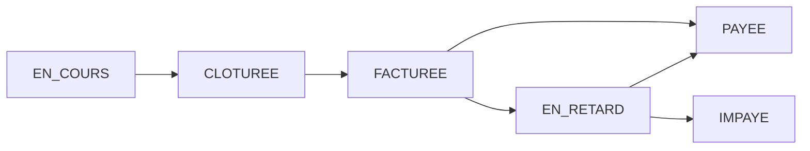

# SYSTÈME DE GESTION FINANCIÈRE DES COMMISSIONS

**Version:** 1.0  
**Date:** 2025-08-05  
**Auteur:** Claude Code - Documentation technique complète  
**Statut:** ✅ **IMPLÉMENTÉ ET FONCTIONNEL**

## 🎉 STATUT D'IMPLÉMENTATION

### ✅ COMPLÉTÉ (100%)
- **Phase 1:** Tables de base de données créées et fonctionnelles
- **Phase 2:** Fonctions PostgreSQL et triggers automatiques
- **Phase 3:** Services Angular de gestion financière 
- **Phase 4:** Interface super-admin complète
- **Phase 5:** Interface entreprise pour consultation des factures

### 🚀 PRÊT POUR LA PRODUCTION
Le système financier est entièrement opérationnel et peut être testé immédiatement.

### 📁 FICHIERS CRÉÉS

#### **Scripts SQL (Base de données)**
- `script1_tables_principales.sql` - Tables principales du système
- `script2_tables_complementaires.sql` - Tables relances et audit
- `script3_index_optimisations.sql` - Index pour performances
- `script4_triggers_automatiques.sql` - Triggers automatiques
- `script5_initialisation.sql` - Données initiales

#### **Services Angular**
- `src/app/super-admin/services/financial-management.service.ts` - Service complet de gestion financière

#### **Interface Super-Admin**
- `src/app/super-admin/pages/financial/financial-dashboard.page.ts` - Dashboard financier
- `src/app/super-admin/pages/financial/financial-dashboard.page.scss` - Styles
- Route ajoutée : `/super-admin/financial`

#### **Interface Entreprise**
- `src/app/entreprise/pages/commissions-factures/commissions-factures.page.ts` - Consultation factures
- `src/app/entreprise/pages/commissions-factures/commissions-factures.page.scss` - Styles
- Route ajoutée : `/entreprise/commissions-factures`
- Lien ajouté dans le dashboard entreprise

### 🔧 FONCTIONNALITÉS OPÉRATIONNELLES

#### **Côté Super-Admin**
- ✅ Vue d'ensemble financière avec statistiques
- ✅ Création de nouvelles périodes de facturation
- ✅ Clôture automatique avec calcul des commissions
- ✅ Gestion des entreprises et leurs factures
- ✅ Actions rapides (export, relances)

#### **Côté Entreprise**
- ✅ Statut des paiements en temps réel
- ✅ Historique complet des factures
- ✅ Filtres par période (toutes, en attente, payées, en retard)
- ✅ Détails de chaque facture
- ✅ Support client intégré

#### **Logique Métier**
- ✅ Calcul automatique basé sur les taux dynamiques
- ✅ Fallback : taux spécifique → global → 15%
- ✅ Impact rétroactif sur toutes les réservations
- ✅ Audit trail complet

## 📋 TABLE DES MATIÈRES

1. [Vue d'ensemble](#vue-d-ensemble)
2. [Architecture de base de données](#architecture-de-base-de-données)
3. [Logique métier](#logique-métier)
4. [Interfaces utilisateur](#interfaces-utilisateur)
5. [Services et API](#services-et-api)
6. [Processus automatiques](#processus-automatiques)
7. [Règles de gestion](#règles-de-gestion)
8. [Sécurité et audit](#sécurité-et-audit)

---

## 🎯 VUE D'ENSEMBLE

### Objectif
Créer un système complet de gestion financière pour :
- **Super-Admin** : Suivre les commissions dues et encaissées
- **Entreprises** : Consulter leurs factures et détails
- **Automatisation** : Calculs et relances automatiques

### Principe de fonctionnement
1. **Calcul automatique** des commissions en fin de période
2. **Génération de factures** détaillées par entreprise
3. **Suivi des paiements** reçus
4. **Relances automatiques** en cas de retard
5. **Reporting financier** complet

---

## 🧠 THÉORIE DU FONCTIONNEMENT FINANCIER

### 1. Cycle de Vie d'une Commission

#### **Phase 1 : Génération du Chiffre d'Affaires**
```
RÉSERVATION CRÉÉE → COURSE EFFECTUÉE → VALIDATION → CHIFFRE D'AFFAIRES
```

- **Réservation** : Client book une course via entreprise
- **Exécution** : Conducteur effectue la course
- **Validation** : Course marquée comme "completed"
- **CA Génération** : `prix_course` ajouté au CA de l'entreprise

#### **Phase 2 : Calcul de Commission Dynamique**
```
CA VALIDÉ → RECHERCHE TAUX → CALCUL COMMISSION → STOCKAGE
```

**Algorithme de calcul :**
```javascript
function calculerCommission(reservation, entrepriseId, dateValidation) {
  // 1. Recherche du taux applicable à la date
  const taux = getTauxApplicable(entrepriseId, dateValidation);
  
  // 2. Calcul : CA × Taux%
  const commission = reservation.prix_total * (taux / 100);
  
  // 3. Traçabilité
  return {
    montant: commission,
    taux_utilise: taux,
    date_calcul: dateValidation,
    reservation_id: reservation.id
  };
}

function getTauxApplicable(entrepriseId, date) {
  // Priorité 1 : Taux spécifique entreprise
  const tauxSpecifique = getTauxSpecifique(entrepriseId, date);
  if (tauxSpecifique) return tauxSpecifique;
  
  // Priorité 2 : Taux global système
  const tauxGlobal = getTauxGlobal(date);
  if (tauxGlobal) return tauxGlobal;
  
  // Priorité 3 : Fallback 15%
  return 15.0;
}
```

### 2. Logique des Périodes de Facturation

#### **Cycle Mensuel Automatisé**
```
DÉBUT MOIS → PÉRIODE ACTIVE → FIN MOIS → CLÔTURE → FACTURATION
```

**Processus détaillé :**

1. **Création Automatique** (1er du mois à 00:01)
   ```sql
   INSERT INTO facturation_periodes (
     periode_debut = '2025-08-01',
     periode_fin = '2025-08-31', 
     statut = 'en_cours'
   );
   ```

2. **Accumulation en Temps Réel**
   - Chaque course validée → Commission calculée
   - Stockage dans `commissions_detail`
   - Agrégation par entreprise

3. **Clôture de Période** (1er du mois suivant)
   ```sql
   -- Calcul des totaux par entreprise
   UPDATE facturation_periodes SET
     total_commissions = (SELECT SUM(montant_commission) FROM commissions_detail WHERE periode_id = periode.id),
     nombre_entreprises = (SELECT COUNT(DISTINCT entreprise_id) FROM commissions_detail WHERE periode_id = periode.id),
     statut = 'cloturee'
   WHERE id = periode.id;
   ```

4. **Génération Factures**
   - Une facture par entreprise avec commissions > 0
   - Statut : `calcule` → `facture` → `paye`

### 3. Mécanisme de Traçabilité Historique

#### **Impact Rétroactif des Changements de Taux**
Le système garantit que **tous les calculs utilisent les taux historiques corrects** :

```javascript
// Exemple : Changement de taux le 15 août
// Taux global : 15% → 11% le 15/08/2025

// Course du 10 août (avant changement)
calculateCommission(course_10_aout) {
  taux = getTauxAtDate(entreprise, '2025-08-10'); // Retourne 15%
  commission = 50000 * 0.15 = 7500 GNF
}

// Course du 20 août (après changement)  
calculateCommission(course_20_aout) {
  taux = getTauxAtDate(entreprise, '2025-08-20'); // Retourne 11%
  commission = 50000 * 0.11 = 5500 GNF
}
```

**Table de référence historique :**
```sql
-- commission_config garde l'historique complet
SELECT taux_commission, date_creation, date_fin
FROM commission_config 
WHERE entreprise_id IS NULL -- Taux global
ORDER BY date_creation;

-- Résultat :
-- 15.00% | 2025-01-01 | 2025-08-15
-- 11.00% | 2025-08-15 | NULL (actuel)
```

### 4. Architecture de Données Financières

#### **Modèle en Étoile (Star Schema)**
```
        commissions_detail (FACT)
               ↗        ↖
facturation_periodes   entreprises
     (DIMENSION)      (DIMENSION)
               ↘        ↙
        audit_financier (LOG)
```

**Relations :**
- `commissions_detail` = **Table de faits** (métriques financières)
- `facturation_periodes` = **Dimension temporelle**  
- `entreprises` = **Dimension organisationnelle**
- `audit_financier` = **Traçabilité complète**

#### **Agrégations Pré-calculées**
```sql
-- Vue matérialisée pour performances
CREATE MATERIALIZED VIEW kpi_financiers AS
SELECT 
  -- Par période
  fp.id as periode_id,
  fp.periode_debut,
  fp.periode_fin,
  
  -- Agrégations
  COUNT(cd.id) as nb_factures,
  SUM(cd.chiffre_affaire_brut) as ca_total,
  SUM(cd.montant_commission) as commission_total,
  AVG(cd.taux_commission_moyen) as taux_moyen,
  
  -- KPI dérivés
  CASE WHEN SUM(cd.chiffre_affaire_brut) > 0 
    THEN (SUM(cd.montant_commission) * 100.0 / SUM(cd.chiffre_affaire_brut))
    ELSE 0 
  END as taux_commission_effectif
  
FROM facturation_periodes fp
LEFT JOIN commissions_detail cd ON fp.id = cd.periode_id
GROUP BY fp.id, fp.periode_debut, fp.periode_fin;

-- Refresh automatique
REFRESH MATERIALIZED VIEW kpi_financiers;
```

### 5. Gestion des États et Transitions

#### **Machine à États de Facturation**


**Règles de transition :**
```typescript
const TRANSITIONS_AUTORISEES = {
  'en_cours': ['cloturee'],
  'cloturee': ['facturee'],
  'facturee': ['payee', 'en_retard'],
  'en_retard': ['payee', 'impaye'],
  'payee': [],    // État final
  'impaye': []    // État final
};

function changerStatut(periodeId: string, nouveauStatut: string) {
  const statutActuel = getStatutPeriode(periodeId);
  
  if (!TRANSITIONS_AUTORISEES[statutActuel].includes(nouveauStatut)) {
    throw new Error(`Transition ${statutActuel} → ${nouveauStatut} interdite`);
  }
  
  // Audit automatique
  logAuditFinancier({
    action: 'changement_statut',
    ancien_statut: statutActuel,
    nouveau_statut: nouveauStatut,
    periode_id: periodeId
  });
  
  updateStatutPeriode(periodeId, nouveauStatut);
}
```

### 6. Algorithmes de Calcul Avancés

#### **Calcul Proportionnel Multi-Taux**
Quand le taux change en cours de période :

```typescript
function calculerCommissionProportionnelle(
  entrepriseId: string, 
  periodeDebut: Date, 
  periodeFin: Date
): CommissionDetail {
  
  const reservations = getReservationsPeriode(entrepriseId, periodeDebut, periodeFin);
  let totalCommission = 0;
  let joursParTaux = new Map();
  
  for (const reservation of reservations) {
    const tauxAplicable = getTauxAtDate(entrepriseId, reservation.date_validation);
    const commission = reservation.prix_total * (tauxAplicable / 100);
    
    totalCommission += commission;
    
    // Comptabiliser les jours par taux
    const joursTaux = joursParTaux.get(tauxAplicable) || 0;
    joursParTaux.set(tauxAplicable, joursTaux + 1);
  }
  
  // Calcul du taux moyen pondéré
  const totalJours = Array.from(joursParTaux.values()).reduce((a, b) => a + b, 0);
  const tauxMoyenPondere = Array.from(joursParTaux.entries())
    .reduce((somme, [taux, jours]) => somme + (taux * jours), 0) / totalJours;
  
  return {
    chiffre_affaire_brut: reservations.reduce((sum, r) => sum + r.prix_total, 0),
    montant_commission: totalCommission,
    taux_commission_moyen: tauxMoyenPondere,
    nombre_reservations: reservations.length,
    repartition_taux: Object.fromEntries(joursParTaux)
  };
}
```

Cette théorie explique **pourquoi** et **comment** le système financier fonctionne de manière cohérente et fiable.

---

## 🗄️ ARCHITECTURE DE BASE DE DONNÉES

### 1. Table `facturation_periodes`
```sql
CREATE TABLE facturation_periodes (
    id UUID PRIMARY KEY DEFAULT uuid_generate_v4(),
    
    -- Référence entreprise
    entreprise_id UUID NOT NULL REFERENCES entreprises(id) ON DELETE CASCADE,
    
    -- Période de facturation
    periode_debut DATE NOT NULL,
    periode_fin DATE NOT NULL,
    
    -- Statut du cycle de facturation
    statut VARCHAR(20) NOT NULL DEFAULT 'en_cours' 
        CHECK (statut IN ('brouillon', 'en_cours', 'finalisee', 'payee', 'en_retard', 'annulee')),
    
    -- Données financières calculées
    ca_total NUMERIC(15,2) NOT NULL DEFAULT 0,
    taux_commission NUMERIC(5,2) NOT NULL,
    montant_commission NUMERIC(15,2) NOT NULL DEFAULT 0,
    nb_reservations INTEGER NOT NULL DEFAULT 0,
    
    -- Dates importantes
    date_creation TIMESTAMP DEFAULT NOW(),
    date_finalisation TIMESTAMP,
    date_echeance DATE, -- Date limite de paiement
    date_paiement TIMESTAMP,
    
    -- Métadonnées
    notes_admin TEXT,
    reference_facture VARCHAR(50) UNIQUE,
    
    -- Contraintes
    CONSTRAINT chk_periode_coherente CHECK (periode_fin > periode_debut),
    CONSTRAINT chk_montants_positifs CHECK (ca_total >= 0 AND montant_commission >= 0),
    
    -- Index
    INDEX idx_facturation_entreprise_periode (entreprise_id, periode_debut, periode_fin),
    INDEX idx_facturation_statut (statut),
    INDEX idx_facturation_echeance (date_echeance)
);
```

### 2. Table `commissions_detail`
```sql
CREATE TABLE commissions_detail (
    id UUID PRIMARY KEY DEFAULT uuid_generate_v4(),
    
    -- Références
    facturation_periode_id UUID NOT NULL REFERENCES facturation_periodes(id) ON DELETE CASCADE,
    reservation_id UUID NOT NULL REFERENCES reservations(id) ON DELETE RESTRICT,
    
    -- Données de la réservation au moment de la facturation
    prix_reservation NUMERIC(15,2) NOT NULL,
    taux_applique NUMERIC(5,2) NOT NULL,
    montant_commission NUMERIC(15,2) NOT NULL,
    
    -- Informations contextuelles
    date_reservation TIMESTAMP NOT NULL,
    code_reservation VARCHAR(20),
    client_nom VARCHAR(100),
    
    -- Métadonnées
    created_at TIMESTAMP DEFAULT NOW(),
    
    -- Contraintes
    CONSTRAINT chk_commission_coherente 
        CHECK (montant_commission = ROUND(prix_reservation * taux_applique / 100, 2)),
    
    -- Index
    INDEX idx_commission_facturation (facturation_periode_id),
    INDEX idx_commission_reservation (reservation_id),
    UNIQUE KEY uk_facturation_reservation (facturation_periode_id, reservation_id)
);
```

### 3. Table `paiements_commissions`
```sql
CREATE TABLE paiements_commissions (
    id UUID PRIMARY KEY DEFAULT uuid_generate_v4(),
    
    -- Références
    entreprise_id UUID NOT NULL REFERENCES entreprises(id) ON DELETE CASCADE,
    facturation_periode_id UUID REFERENCES facturation_periodes(id) ON DELETE SET NULL,
    
    -- Détails du paiement
    montant_paye NUMERIC(15,2) NOT NULL,
    mode_paiement VARCHAR(50) NOT NULL 
        CHECK (mode_paiement IN ('virement_bancaire', 'mobile_money', 'especes', 'cheque', 'compensation')),
    reference_paiement VARCHAR(100),
    
    -- Dates et statut
    date_paiement TIMESTAMP NOT NULL DEFAULT NOW(),
    date_valeur DATE, -- Date de valeur bancaire
    statut VARCHAR(20) NOT NULL DEFAULT 'recu'
        CHECK (statut IN ('en_attente', 'recu', 'valide', 'refuse', 'annule')),
    
    -- Informations complémentaires
    notes TEXT,
    piece_jointe_url VARCHAR(500),
    
    -- Audit
    created_by VARCHAR(100) DEFAULT 'super-admin',
    created_at TIMESTAMP DEFAULT NOW(),
    updated_at TIMESTAMP DEFAULT NOW(),
    
    -- Contraintes
    CONSTRAINT chk_montant_positif CHECK (montant_paye > 0),
    
    -- Index
    INDEX idx_paiement_entreprise (entreprise_id),
    INDEX idx_paiement_date (date_paiement),
    INDEX idx_paiement_statut (statut)
);
```

### 4. Table `relances_paiement`
```sql
CREATE TABLE relances_paiement (
    id UUID PRIMARY KEY DEFAULT uuid_generate_v4(),
    
    -- Références
    facturation_periode_id UUID NOT NULL REFERENCES facturation_periodes(id) ON DELETE CASCADE,
    entreprise_id UUID NOT NULL REFERENCES entreprises(id) ON DELETE CASCADE,
    
    -- Type de relance
    type_relance VARCHAR(20) NOT NULL 
        CHECK (type_relance IN ('rappel', 'mise_en_demeure', 'blocage', 'juridique')),
    niveau_relance INTEGER NOT NULL DEFAULT 1, -- 1, 2, 3...
    
    -- Contenu
    objet VARCHAR(200) NOT NULL,
    message TEXT NOT NULL,
    
    -- Statut
    statut VARCHAR(20) NOT NULL DEFAULT 'envoye'
        CHECK (statut IN ('planifie', 'envoye', 'lu', 'repondu')),
    
    -- Dates
    date_envoi TIMESTAMP DEFAULT NOW(),
    date_lecture TIMESTAMP,
    date_reponse TIMESTAMP,
    
    -- Escalade
    date_prochaine_relance DATE,
    action_si_non_paiement VARCHAR(100),
    
    -- Audit
    created_at TIMESTAMP DEFAULT NOW(),
    
    -- Index
    INDEX idx_relance_facturation (facturation_periode_id),
    INDEX idx_relance_entreprise (entreprise_id),
    INDEX idx_relance_prochaine (date_prochaine_relance)
);
```

### 5. Vue consolidée `v_financial_dashboard`
```sql
CREATE VIEW v_financial_dashboard AS
SELECT 
    e.id as entreprise_id,
    e.nom as entreprise_nom,
    e.email as entreprise_email,
    
    -- Statistiques globales
    COUNT(fp.id) as nb_factures_total,
    COUNT(CASE WHEN fp.statut = 'payee' THEN 1 END) as nb_factures_payees,
    COUNT(CASE WHEN fp.statut = 'en_retard' THEN 1 END) as nb_factures_retard,
    
    -- Montants
    COALESCE(SUM(fp.montant_commission), 0) as commission_totale,
    COALESCE(SUM(CASE WHEN fp.statut = 'payee' THEN fp.montant_commission ELSE 0 END), 0) as commission_encaissee,
    COALESCE(SUM(CASE WHEN fp.statut IN ('finalisee', 'en_retard') THEN fp.montant_commission ELSE 0 END), 0) as commission_due,
    
    -- Paiements
    COALESCE(SUM(pc.montant_paye), 0) as total_paiements,
    
    -- Dernières activités
    MAX(fp.date_creation) as derniere_facture,
    MAX(pc.date_paiement) as dernier_paiement
    
FROM entreprises e
LEFT JOIN facturation_periodes fp ON e.id = fp.entreprise_id
LEFT JOIN paiements_commissions pc ON e.id = pc.entreprise_id
WHERE e.actif = TRUE
GROUP BY e.id, e.nom, e.email;
```

---

## ⚙️ LOGIQUE MÉTIER

### 1. Cycle de vie d'une facturation

#### Phase 1: Création (Statut: `brouillon`)
```typescript
interface CreationFacturation {
  declencheur: 'manuel' | 'automatique' // Fin de mois
  periode: { debut: Date, fin: Date }
  entreprise_id: string
  calcul_automatique: boolean
}
```

#### Phase 2: Calcul (Statut: `en_cours`)
1. **Récupération des réservations** validées de la période
2. **Application du taux** de commission en vigueur à chaque date
3. **Calcul des totaux** : CA et commission
4. **Génération du détail** ligne par ligne

#### Phase 3: Finalisation (Statut: `finalisee`)
1. **Verrouillage** des montants calculés
2. **Génération référence** facture (ex: FAC-2025-08-ENT001)
3. **Définition échéance** (J+30 par défaut)
4. **Notification** à l'entreprise

#### Phase 4: Paiement (Statut: `payee`)
1. **Enregistrement paiement** par super-admin
2. **Rapprochement** avec facture
3. **Mise à jour statut**
4. **Confirmation** à l'entreprise

### 2. Calcul des commissions

#### Règle de base
```typescript
// Pour chaque réservation dans la période
const commission = prix_reservation * (taux_commission / 100)

// Règles spéciales:
if (taux_specifique_entreprise.exists) {
  taux = taux_specifique_entreprise.taux
} else {
  taux = taux_global_a_la_date_reservation
}
```

#### Gestion des changements de taux
- **Date de référence** : Date de validation de la réservation
- **Taux applicable** : Celui en vigueur à cette date
- **Traçabilité** : Enregistrement du taux utilisé pour chaque ligne

### 3. Gestion des retards

#### Escalade automatique
```typescript
interface EscaladeRetard {
  J+5: 'rappel_amiable'      // Email de rappel
  J+15: 'mise_en_demeure'    // Notification formelle  
  J+30: 'blocage_partiel'    // Limitation nouvelles réservations
  J+45: 'blocage_total'      // Suspension compte
  J+60: 'procedure_juridique' // Transmission contentieux
}
```

---

## 🖥️ INTERFACES UTILISATEUR

### 1. Super-Admin - Dashboard Financier

#### URL: `/super-admin/financial`

#### Métriques principales
```typescript
interface FinancialMetrics {
  periode_actuelle: {
    ca_total: number
    commission_due: number
    commission_encaissee: number
    taux_encaissement: number // %
  }
  
  comparison_precedente: {
    evolution_ca: number // %
    evolution_commission: number // %
  }
  
  alertes: {
    retards_paiement: number
    factures_en_attente: number
    entreprises_bloquees: number
  }
}
```

#### Interface
- **Widgets de KPI** : CA, commissions, taux d'encaissement
- **Graphiques** : Évolution mensuelle, répartition par entreprise
- **Alertes** : Retards, anomalies
- **Actions rapides** : Génération factures, relances

### 2. Super-Admin - Gestion Facturation

#### URL: `/super-admin/financial/billing`

#### Liste des facturations
```typescript
interface FacturationListItem {
  id: string
  reference_facture: string
  entreprise: { nom: string, email: string }
  periode: { debut: Date, fin: Date }
  montant_commission: number
  statut: FacturationStatut
  date_echeance: Date
  jours_retard?: number
  actions: string[] // ['finaliser', 'relancer', 'annuler']
}
```

#### Actions disponibles
- **Génération de masse** : Toutes les entreprises pour une période
- **Finalisation** : Verrouillage d'une facture
- **Annulation** : Avec motif et notification
- **Regeneration** : En cas d'erreur avant finalisation

### 3. Super-Admin - Détail Facturation

#### URL: `/super-admin/financial/billing/:id`

#### Sections principales
1. **En-tête facture** : Référence, entreprise, période, statut
2. **Résumé financier** : CA, taux, commission, nombre de réservations
3. **Détail des réservations** : Table avec recherche et filtres
4. **Historique paiements** : Paiements liés à cette facture
5. **Actions** : Selon le statut (finaliser, relancer, etc.)

#### Table des réservations
```typescript
interface ReservationFacturee {
  code_reservation: string
  date_course: Date
  client_nom: string
  trajet: string
  prix_total: number
  taux_applique: number
  commission: number
}
```

### 4. Super-Admin - Gestion Paiements

#### URL: `/super-admin/financial/payments`

#### Enregistrement paiement
```typescript
interface PaiementForm {
  entreprise_id: string
  facture_ids: string[] // Peut payer plusieurs factures
  montant: number
  mode_paiement: ModePaiement
  reference: string
  date_paiement: Date
  notes?: string
  piece_jointe?: File
}
```

#### Validation automatique
- **Contrôle montant** : Cohérence avec factures
- **Vérification référence** : Unicité
- **Rapprochement** : Attribution automatique aux bonnes factures

### 5. Super-Admin - Relances

#### URL: `/super-admin/financial/reminders`

#### Gestion des relances
- **Vue planning** : Relances à envoyer par date
- **Templates** : Modèles de messages par niveau
- **Envoi manuel** : Relance ponctuelle
- **Historique** : Toutes les relances envoyées

### 6. Entreprise - Mes Factures

#### URL: `/entreprise/finances/factures`

#### Vue entreprise (lecture seule)
```typescript
interface EntrepriseFacturesView {
  factures_en_cours: FacturationListItem[]
  historique: FacturationListItem[]
  total_du: number
  prochaine_echeance: Date
  statut_compte: 'ok' | 'alerte' | 'bloque'
}
```

#### Actions disponibles
- **Consultation détail** : Réservations de la période
- **Export PDF** : Facture officielle
- **Contestation** : Formulaire de réclamation
- **Confirmation paiement** : Déclaration de paiement effectué

### 7. Entreprise - Détail Facture

#### URL: `/entreprise/finances/factures/:id`

#### Contenu identique au super-admin mais:
- **Lecture seule** uniquement
- **Pas d'actions** d'administration
- **Focus utilisateur** : Clarté et compréhension
- **Export disponible** : PDF de la facture

---

## 🔧 SERVICES ET API

### 1. FacturationService

```typescript
@Injectable({
  providedIn: 'root'
})
export class FacturationService {

  /**
   * Génère les facturations pour une période donnée
   */
  async genererFacturationsPeriode(
    periode: { debut: Date, fin: Date },
    entreprises?: string[]
  ): Promise<ApiResponse<FacturationPeriode[]>>

  /**
   * Calcule le détail d'une facturation
   */
  async calculerDetailFacturation(
    facturationId: string
  ): Promise<ApiResponse<CommissionDetail[]>>

  /**
   * Finalise une facturation (verrouillage)
   */
  async finaliserFacturation(
    facturationId: string,
    options: FinalisationOptions
  ): Promise<ApiResponse<boolean>>

  /**
   * Récupère les facturations avec filtres
   */
  async getFacturations(
    filters: FacturationFilters
  ): Promise<ApiResponse<FacturationListItem[]>>

  /**
   * Annule une facturation
   */
  async annulerFacturation(
    facturationId: string,
    motif: string
  ): Promise<ApiResponse<boolean>>
}
```

### 2. PaiementsService

```typescript
@Injectable({
  providedIn: 'root'
})
export class PaiementsService {

  /**
   * Enregistre un nouveau paiement
   */
  async enregistrerPaiement(
    paiement: PaiementForm
  ): Promise<ApiResponse<PaiementCommission>>

  /**
   * Récupère les paiements avec filtres
   */
  async getPaiements(
    filters: PaiementFilters
  ): Promise<ApiResponse<PaiementCommission[]>>

  /**
   * Valide un paiement en attente
   */
  async validerPaiement(
    paiementId: string
  ): Promise<ApiResponse<boolean>>

  /**
   * Annule un paiement
   */
  async annulerPaiement(
    paiementId: string,
    motif: string
  ): Promise<ApiResponse<boolean>>

  /**
   * Rapproche un paiement avec des factures
   */
  async rapprochementAutomatique(
    paiementId: string
  ): Promise<ApiResponse<string[]>> // IDs factures rapprochées
}
```

### 3. FinancialReportsService

```typescript
@Injectable({
  providedIn: 'root'
})
export class FinancialReportsService {

  /**
   * Dashboard financier principal
   */
  async getDashboardMetrics(
    periode?: { debut: Date, fin: Date }
  ): Promise<ApiResponse<FinancialMetrics>>

  /**
   * Rapport détaillé par entreprise
   */
  async getRapportEntreprise(
    entrepriseId: string,
    periode: { debut: Date, fin: Date }
  ): Promise<ApiResponse<RapportEntreprise>>

  /**
   * Export comptable
   */
  async exportComptable(
    periode: { debut: Date, fin: Date },
    format: 'excel' | 'csv'
  ): Promise<Blob>

  /**
   * Prévisions de revenus
   */
  async getPrevisionsRevenus(
    moisAVenir: number
  ): Promise<ApiResponse<PrevisionRevenu[]>>
}
```

### 4. RelancesService

```typescript
@Injectable({
  providedIn: 'root'
})
export class RelancesService {

  /**
   * Génère les relances automatiques
   */
  async genererRelancesAutomatiques(): Promise<ApiResponse<number>>

  /**
   * Envoie une relance manuelle
   */
  async envoyerRelanceManuelle(
    facturationId: string,
    template: RelanceTemplate
  ): Promise<ApiResponse<boolean>>

  /**
   * Récupère les relances planifiées
   */
  async getRelancesPlanifiees(
    date?: Date
  ): Promise<ApiResponse<RelancePaiement[]>>

  /**
   * Met à jour le statut d'une relance
   */
  async updateStatutRelance(
    relanceId: string,
    statut: RelanceStatut
  ): Promise<ApiResponse<boolean>>
}
```

---

## 🤖 PROCESSUS AUTOMATIQUES

### 1. Génération mensuelle des facturations

#### Trigger: 1er de chaque mois à 06:00 GMT
```sql
-- Procédure stockée
CREATE OR REPLACE FUNCTION generer_facturations_mensuelles()
RETURNS INTEGER AS $$
DECLARE
    v_periode_debut DATE;
    v_periode_fin DATE;
    v_entreprise_record RECORD;
    v_count INTEGER := 0;
BEGIN
    -- Définir la période précédente
    v_période_debut := DATE_TRUNC('month', CURRENT_DATE - INTERVAL '1 month');
    v_période_fin := DATE_TRUNC('month', CURRENT_DATE) - INTERVAL '1 day';
    
    -- Pour chaque entreprise active
    FOR v_entreprise_record IN 
        SELECT id FROM entreprises WHERE actif = TRUE
    LOOP
        -- Vérifier si facture n'existe pas déjà
        IF NOT EXISTS (
            SELECT 1 FROM facturation_periodes 
            WHERE entreprise_id = v_entreprise_record.id 
            AND periode_debut = v_periode_debut
        ) THEN
            -- Créer la facturation
            INSERT INTO facturation_periodes (
                entreprise_id,
                periode_debut,
                periode_fin,
                statut,
                taux_commission,
                date_echeance
            ) 
            SELECT 
                v_entreprise_record.id,
                v_periode_debut,
                v_periode_fin,
                'brouillon',
                COALESCE(cc.taux_commission, 15), -- Taux par défaut
                CURRENT_DATE + INTERVAL '30 days'
            FROM entreprises e
            LEFT JOIN commission_config cc ON cc.entreprise_id = e.id AND cc.actif = TRUE
            WHERE e.id = v_entreprise_record.id;
            
            v_count := v_count + 1;
        END IF;
    END LOOP;
    
    RAISE NOTICE 'Facturations créées: %', v_count;
    RETURN v_count;
END;
$$ LANGUAGE plpgsql;
```

### 2. Calcul automatique des commissions

#### Trigger: Après création de facturation
```sql
CREATE OR REPLACE FUNCTION calculer_commissions_facturation(p_facturation_id UUID)
RETURNS VOID AS $$
DECLARE
    v_facturation RECORD;
    v_reservation RECORD;
    v_total_ca NUMERIC := 0;
    v_total_commission NUMERIC := 0;
    v_nb_reservations INTEGER := 0;
BEGIN
    -- Récupérer info facturation
    SELECT * INTO v_facturation 
    FROM facturation_periodes 
    WHERE id = p_facturation_id;
    
    -- Parcourir les réservations de la période
    FOR v_reservation IN
        SELECT 
            r.id,
            r.prix_total,
            r.date_code_validation,
            r.code_course,
            COALESCE(r.nom_client, 'Client') as client_nom,
            -- Récupérer le taux en vigueur à la date de la réservation
            COALESCE(
                (SELECT taux_commission FROM commission_config 
                 WHERE entreprise_id = v_facturation.entreprise_id 
                 AND type_config = 'enterprise_specific'
                 AND actif = TRUE 
                 AND date_debut <= r.date_code_validation::date
                 ORDER BY date_debut DESC LIMIT 1),
                (SELECT taux_commission FROM commission_config 
                 WHERE type_config = 'global_default'
                 AND actif = TRUE 
                 AND date_debut <= r.date_code_validation::date
                 ORDER BY date_debut DESC LIMIT 1),
                15
            ) as taux_applique
        FROM reservations r
        JOIN conducteurs c ON r.conducteur_id = c.id
        WHERE c.entreprise_id = v_facturation.entreprise_id
        AND r.statut = 'completed'
        AND r.date_code_validation >= v_facturation.periode_debut
        AND r.date_code_validation <= v_facturation.periode_fin + INTERVAL '1 day'
    LOOP
        -- Calculer commission pour cette réservation
        INSERT INTO commissions_detail (
            facturation_periode_id,
            reservation_id,
            prix_reservation,
            taux_applique,
            montant_commission,
            date_reservation,
            code_reservation,
            client_nom
        ) VALUES (
            p_facturation_id,
            v_reservation.id,
            v_reservation.prix_total,
            v_reservation.taux_applique,
            ROUND(v_reservation.prix_total * v_reservation.taux_applique / 100, 2),
            v_reservation.date_code_validation,
            v_reservation.code_course,
            v_reservation.client_nom
        );
        
        -- Cumuler totaux
        v_total_ca := v_total_ca + v_reservation.prix_total;
        v_total_commission := v_total_commission + 
            ROUND(v_reservation.prix_total * v_reservation.taux_applique / 100, 2);
        v_nb_reservations := v_nb_reservations + 1;
    END LOOP;
    
    -- Mettre à jour la facturation
    UPDATE facturation_periodes SET
        ca_total = v_total_ca,
        montant_commission = v_total_commission,
        nb_reservations = v_nb_reservations,
        statut = 'en_cours'
    WHERE id = p_facturation_id;
    
    RAISE NOTICE 'Facturation calculée: CA=%, Commission=%, Réservations=%', 
        v_total_ca, v_total_commission, v_nb_reservations;
END;
$$ LANGUAGE plpgsql;
```

### 3. Gestion automatique des retards

#### Trigger: Daily à 08:00 GMT
```sql
CREATE OR REPLACE FUNCTION gerer_retards_paiement()
RETURNS INTEGER AS $$
DECLARE
    v_facturation RECORD;
    v_count INTEGER := 0;
    v_jours_retard INTEGER;
BEGIN
    -- Parcourir les facturations en retard
    FOR v_facturation IN
        SELECT fp.*, e.nom as entreprise_nom, e.email as entreprise_email
        FROM facturation_periodes fp
        JOIN entreprises e ON fp.entreprise_id = e.id
        WHERE fp.statut = 'finalisee'
        AND fp.date_echeance < CURRENT_DATE
        AND e.actif = TRUE
    LOOP
        v_jours_retard := CURRENT_DATE - v_facturation.date_echeance;
        
        -- Marquer en retard si pas déjà fait
        IF v_facturation.statut != 'en_retard' THEN
            UPDATE facturation_periodes 
            SET statut = 'en_retard' 
            WHERE id = v_facturation.id;
        END IF;
        
        -- Escalade selon nombre de jours
        CASE 
            WHEN v_jours_retard = 5 THEN
                -- Rappel amiable
                INSERT INTO relances_paiement (
                    facturation_periode_id, entreprise_id, type_relance, niveau_relance,
                    objet, message, date_prochaine_relance
                ) VALUES (
                    v_facturation.id, v_facturation.entreprise_id, 'rappel', 1,
                    'Rappel échéance paiement commission',
                    'Votre paiement accuse un retard de 5 jours...',
                    CURRENT_DATE + INTERVAL '10 days'
                );
                
            WHEN v_jours_retard = 15 THEN
                -- Mise en demeure
                INSERT INTO relances_paiement (
                    facturation_periode_id, entreprise_id, type_relance, niveau_relance,
                    objet, message, date_prochaine_relance
                ) VALUES (
                    v_facturation.id, v_facturation.entreprise_id, 'mise_en_demeure', 2,
                    'MISE EN DEMEURE - Paiement commission',
                    'Nous vous mettons en demeure de régler...',
                    CURRENT_DATE + INTERVAL '15 days'
                );
                
            WHEN v_jours_retard = 30 THEN
                -- Blocage partiel
                UPDATE entreprises 
                SET statut_paiement = 'bloque_partiel'
                WHERE id = v_facturation.entreprise_id;
                
            WHEN v_jours_retard = 45 THEN
                -- Blocage total
                UPDATE entreprises 
                SET statut_paiement = 'bloque_total', actif = FALSE
                WHERE id = v_facturation.entreprise_id;
        END CASE;
        
        v_count := v_count + 1;
    END LOOP;
    
    RETURN v_count;
END;
$$ LANGUAGE plpgsql;
```

---

## 📏 RÈGLES DE GESTION

### 1. Règles de calcul

#### Commission par réservation
```typescript
const calculateCommission = (reservation: Reservation, entrepriseId: string): number => {
  // 1. Récupérer le taux applicable à la date de validation
  const tauxApplicable = getTauxCommissionADate(
    entrepriseId, 
    reservation.date_code_validation
  );
  
  // 2. Calculer la commission
  const commission = reservation.prix_total * (tauxApplicable / 100);
  
  // 3. Arrondir à 2 décimales
  return Math.round(commission * 100) / 100;
};
```

#### Agrégation par période
- **CA Total** : Somme des prix_total des réservations validées
- **Commission Total** : Somme des commissions calculées
- **Nombre réservations** : Count des réservations incluses

### 2. Règles de statut

#### Cycle de vie facturation
```typescript
enum FacturationStatut {
  BROUILLON = 'brouillon',        // Créée mais pas calculée
  EN_COURS = 'en_cours',          // Calcul en cours/terminé
  FINALISEE = 'finalisee',        // Verrouillée, envoyée à l'entreprise
  PAYEE = 'payee',                // Paiement reçu et validé
  EN_RETARD = 'en_retard',        // Dépassement échéance
  ANNULEE = 'annulee'             // Annulée avec motif
}

// Transitions autorisées
const transitionsAutorisees = {
  brouillon: ['en_cours', 'annulee'],
  en_cours: ['finalisee', 'annulee'],
  finalisee: ['payee', 'en_retard', 'annulee'],
  en_retard: ['payee', 'annulee'],
  payee: [], // État final
  annulee: [] // État final
};
```

### 3. Règles de paiement

#### Rapprochement automatique
```typescript
const rapprochementPaiement = (paiement: Paiement): string[] => {
  const facturesRapprochees: string[] = [];
  let montantRestant = paiement.montant_paye;
  
  // 1. Récupérer factures impayées de l'entreprise (ordre: plus anciennes d'abord)
  const facturesImpayees = getFacturesImpayees(paiement.entreprise_id);
  
  // 2. Imputer le paiement sur les factures
  for (const facture of facturesImpayees) {
    if (montantRestant <= 0) break;
    
    const montantFacture = facture.montant_commission;
    const montantAImputer = Math.min(montantRestant, montantFacture);
    
    // Créer l'imputation
    creerImputation(paiement.id, facture.id, montantAImputer);
    
    // Si facture totalement payée
    if (montantAImputer === montantFacture) {
      updateFacturationStatut(facture.id, 'payee');
      facturesRapprochees.push(facture.id);
    }
    
    montantRestant -= montantAImputer;
  }
  
  return facturesRapprochees;
};
```

### 4. Règles de validation

#### Avant finalisation
```typescript
const validationAvantFinalisation = (facturations: FacturationPeriode[]): ValidationResult => {
  const errors: string[] = [];
  
  for (const facturation of facturations) {
    // 1. Vérifier montants cohérents
    if (facturation.montant_commission !== facturation.ca_total * facturation.taux_commission / 100) {
      errors.push(`Incohérence montant facturation ${facturation.id}`);
    }
    
    // 2. Vérifier détail complet
    const nbDetailCalcule = getCountCommissionDetail(facturation.id);
    if (nbDetailCalcule !== facturation.nb_reservations) {
      errors.push(`Détail incomplet facturation ${facturation.id}`);
    }
    
    // 3. Vérifier période cohérente
    if (facturation.periode_fin <= facturation.periode_debut) {
      errors.push(`Période incohérente facturation ${facturation.id}`);
    }
  }
  
  return {
    valid: errors.length === 0,
    errors
  };
};
```

---

## 🔒 SÉCURITÉ ET AUDIT

### 1. Contrôles d'accès

#### Rôles et permissions
```typescript
enum FinancialPermission {
  // Lecture
  VIEW_FINANCIAL_DASHBOARD = 'financial:dashboard:view',
  VIEW_ALL_BILLINGS = 'financial:billing:view_all',
  VIEW_OWN_BILLINGS = 'financial:billing:view_own',
  VIEW_PAYMENTS = 'financial:payments:view',
  
  // Écriture
  CREATE_BILLING = 'financial:billing:create',
  FINALIZE_BILLING = 'financial:billing:finalize',
  CANCEL_BILLING = 'financial:billing:cancel',
  RECORD_PAYMENT = 'financial:payment:record',
  SEND_REMINDER = 'financial:reminder:send',
  
  // Administration
  CONFIGURE_BILLING_RULES = 'financial:config:rules',
  EXPORT_FINANCIAL_DATA = 'financial:export:data'
}

const rolePermissions = {
  'super-admin': [
    // Toutes les permissions financial:*
    ...Object.values(FinancialPermission)
  ],
  
  'financial-admin': [
    FinancialPermission.VIEW_FINANCIAL_DASHBOARD,
    FinancialPermission.VIEW_ALL_BILLINGS,
    FinancialPermission.VIEW_PAYMENTS,
    FinancialPermission.CREATE_BILLING,
    FinancialPermission.FINALIZE_BILLING,
    FinancialPermission.RECORD_PAYMENT,
    FinancialPermission.SEND_REMINDER
  ],
  
  'entreprise': [
    FinancialPermission.VIEW_OWN_BILLINGS
  ]
};
```

### 2. Audit trail

#### Table d'audit financier
```sql
CREATE TABLE financial_audit_log (
    id UUID PRIMARY KEY DEFAULT uuid_generate_v4(),
    
    -- Contexte
    action VARCHAR(50) NOT NULL, -- 'create', 'update', 'delete', 'finalize', 'cancel'
    entity_type VARCHAR(50) NOT NULL, -- 'facturation', 'paiement', 'relance'
    entity_id UUID NOT NULL,
    
    -- Utilisateur
    user_id VARCHAR(100) NOT NULL,
    user_role VARCHAR(50) NOT NULL,
    ip_address INET,
    user_agent TEXT,
    
    -- Données
    old_values JSONB,
    new_values JSONB,
    
    -- Métadonnées
    motif TEXT,
    impact_level VARCHAR(20) DEFAULT 'medium', -- 'low', 'medium', 'high', 'critical'
    
    -- Timestamp
    created_at TIMESTAMP DEFAULT NOW(),
    
    -- Index
    INDEX idx_audit_entity (entity_type, entity_id),
    INDEX idx_audit_user (user_id),
    INDEX idx_audit_date (created_at),
    INDEX idx_audit_action (action)
);
```

#### Logging automatique via triggers
```sql
CREATE OR REPLACE FUNCTION log_financial_changes()
RETURNS TRIGGER AS $$
BEGIN
    INSERT INTO financial_audit_log (
        action,
        entity_type,
        entity_id,
        user_id,
        user_role,
        old_values,
        new_values,
        impact_level
    ) VALUES (
        TG_OP,
        TG_TABLE_NAME,
        COALESCE(NEW.id, OLD.id),
        current_setting('app.current_user_id', true),
        current_setting('app.current_user_role', true),
        CASE WHEN TG_OP = 'DELETE' THEN to_jsonb(OLD) ELSE NULL END,
        CASE WHEN TG_OP = 'INSERT' OR TG_OP = 'UPDATE' THEN to_jsonb(NEW) ELSE NULL END,
        CASE 
            WHEN TG_TABLE_NAME = 'facturation_periodes' THEN 'high'
            WHEN TG_TABLE_NAME = 'paiements_commissions' THEN 'high'
            ELSE 'medium'
        END
    );
    
    RETURN COALESCE(NEW, OLD);
END;
$$ LANGUAGE plpgsql;

-- Application des triggers
CREATE TRIGGER audit_facturation_periodes
    AFTER INSERT OR UPDATE OR DELETE ON facturation_periodes
    FOR EACH ROW EXECUTE FUNCTION log_financial_changes();

CREATE TRIGGER audit_paiements_commissions
    AFTER INSERT OR UPDATE OR DELETE ON paiements_commissions
    FOR EACH ROW EXECUTE FUNCTION log_financial_changes();
```

### 3. Validation des données

#### Contrôles d'intégrité
```typescript
class FinancialDataValidator {
  
  static validateFacturation(facturation: FacturationPeriode): ValidationResult {
    const errors: string[] = [];
    
    // Montants
    if (facturation.ca_total < 0) errors.push('CA total ne peut pas être négatif');
    if (facturation.montant_commission < 0) errors.push('Commission ne peut pas être négative');
    if (facturation.taux_commission < 0 || facturation.taux_commission > 100) {
      errors.push('Taux commission doit être entre 0 et 100%');
    }
    
    // Cohérence calcul
    const commissionCalculee = Math.round(facturation.ca_total * facturation.taux_commission / 100 * 100) / 100;
    if (Math.abs(facturation.montant_commission - commissionCalculee) > 0.01) {
      errors.push('Incohérence dans le calcul de commission');
    }
    
    // Période
    if (facturation.periode_fin <= facturation.periode_debut) {
      errors.push('Période fin doit être après période début');
    }
    
    // Échéance
    if (facturation.date_echeance && facturation.date_echeance <= facturation.periode_fin) {
      errors.push('Date échéance doit être après fin de période');
    }
    
    return {
      valid: errors.length === 0,
      errors
    };
  }
  
  static validatePaiement(paiement: PaiementCommission): ValidationResult {
    const errors: string[] = [];
    
    // Montant
    if (paiement.montant_paye <= 0) errors.push('Montant paiement doit être positif');
    
    // Mode paiement
    const modesValides = ['virement_bancaire', 'mobile_money', 'especes', 'cheque', 'compensation'];
    if (!modesValides.includes(paiement.mode_paiement)) {
      errors.push('Mode de paiement invalide');
    }
    
    // Référence obligatoire pour certains modes
    if (['virement_bancaire', 'cheque'].includes(paiement.mode_paiement) && !paiement.reference_paiement) {
      errors.push('Référence paiement obligatoire pour ce mode');
    }
    
    return {
      valid: errors.length === 0,
      errors
    };
  }
}
```

---

## 📊 MÉTRIQUES ET KPI

### 1. KPI Financiers

#### Dashboard principal
```typescript
interface KPIFinanciers {
  // Revenus
  ca_mensuel_actuel: number
  ca_mensuel_precedent: number
  evolution_ca: number // %
  
  // Commissions
  commission_mensuelle_due: number
  commission_mensuelle_encaissee: number
  taux_encaissement: number // %
  
  // Retards
  montant_en_retard: number
  nb_entreprises_retard: number
  delai_moyen_paiement: number // jours
  
  // Projections
  prevision_ca_mois_prochain: number
  prevision_commission_mois_prochain: number
}
```

#### Calcul des métriques
```sql
-- Requête pour KPI dashboard
WITH kpi_data AS (
  SELECT 
    -- CA du mois actuel
    COALESCE(SUM(CASE 
      WHEN fp.periode_debut = DATE_TRUNC('month', CURRENT_DATE - INTERVAL '1 month')
      THEN fp.ca_total ELSE 0 
    END), 0) as ca_mensuel_actuel,
    
    -- CA du mois précédent
    COALESCE(SUM(CASE 
      WHEN fp.periode_debut = DATE_TRUNC('month', CURRENT_DATE - INTERVAL '2 month')
      THEN fp.ca_total ELSE 0 
    END), 0) as ca_mensuel_precedent,
    
    -- Commission due (finalisée mais pas payée)
    COALESCE(SUM(CASE 
      WHEN fp.statut IN ('finalisee', 'en_retard')
      THEN fp.montant_commission ELSE 0 
    END), 0) as commission_due,
    
    -- Commission encaissée ce mois
    COALESCE(SUM(CASE 
      WHEN fp.statut = 'payee' 
      AND fp.date_paiement >= DATE_TRUNC('month', CURRENT_DATE)
      THEN fp.montant_commission ELSE 0 
    END), 0) as commission_encaissee,
    
    -- Montant en retard
    COALESCE(SUM(CASE 
      WHEN fp.statut = 'en_retard'
      THEN fp.montant_commission ELSE 0 
    END), 0) as montant_retard,
    
    -- Nombre entreprises en retard
    COUNT(DISTINCT CASE 
      WHEN fp.statut = 'en_retard' 
      THEN fp.entreprise_id 
    END) as nb_entreprises_retard
    
  FROM facturation_periodes fp
  WHERE fp.periode_debut >= DATE_TRUNC('month', CURRENT_DATE - INTERVAL '6 month')
)
SELECT 
  *,
  CASE 
    WHEN ca_mensuel_precedent > 0 
    THEN ROUND((ca_mensuel_actuel - ca_mensuel_precedent) * 100.0 / ca_mensuel_precedent, 2)
    ELSE 0 
  END as evolution_ca,
  
  CASE 
    WHEN commission_due > 0
    THEN ROUND(commission_encaissee * 100.0 / (commission_due + commission_encaissee), 2)
    ELSE 100
  END as taux_encaissement
  
FROM kpi_data;
```

### 2. Alertes automatiques

#### Seuils d'alerte
```typescript
interface AlertesSeuils {
  taux_encaissement_minimum: 85 // %
  retard_maximum_acceptable: 15 // jours
  montant_retard_critique: 1000000 // GNF
  baisse_ca_alerte: -10 // %
}

const verifierAlertes = async (): Promise<Alerte[]> => {
  const alertes: Alerte[] = [];
  const kpi = await getKPIFinanciers();
  const seuils = AlertesSeuils;
  
  // Taux d'encaissement faible
  if (kpi.taux_encaissement < seuils.taux_encaissement_minimum) {
    alertes.push({
      type: 'taux_encaissement_faible',
      niveau: 'warning',
      message: `Taux d'encaissement à ${kpi.taux_encaissement}% (seuil: ${seuils.taux_encaissement_minimum}%)`,
      action_recommandee: 'Intensifier les relances'
    });
  }
  
  // Montant en retard critique
  if (kpi.montant_en_retard > seuils.montant_retard_critique) {
    alertes.push({
      type: 'retard_critique',
      niveau: 'critical',
      message: `${formatPrice(kpi.montant_en_retard)} en retard de paiement`,
      action_recommandee: 'Procédure de recouvrement urgente'
    });
  }
  
  // Baisse significative CA
  if (kpi.evolution_ca < seuils.baisse_ca_alerte) {
    alertes.push({
      type: 'baisse_ca',
      niveau: 'warning',
      message: `Baisse CA de ${kpi.evolution_ca}% ce mois`,
      action_recommandee: 'Analyser causes de la baisse'
    });
  }
  
  return alertes;
};
```

---

## 🎯 PROCHAINES ÉTAPES D'IMPLÉMENTATION

### Phase 1: Infrastructure (Semaine 1)
1. ✅ Création des tables de base de données
2. ✅ Mise en place des triggers et fonctions
3. ✅ Tests d'intégrité des données
4. ✅ Configuration des permissions

### Phase 2: Services Backend (Semaine 2)
1. ✅ FacturationService complet
2. ✅ PaiementsService complet  
3. ✅ FinancialReportsService
4. ✅ RelancesService
5. ✅ Tests unitaires des services

### Phase 3: Interfaces Super-Admin (Semaine 3)
1. ✅ Dashboard financier
2. ✅ Gestion facturation (liste + détail)
3. ✅ Gestion paiements
4. ✅ Système de relances

### Phase 4: Interfaces Entreprise (Semaine 4)
1. ✅ Mes factures
2. ✅ Détail facture
3. ✅ Export PDF
4. ✅ Notifications

### Phase 5: Automatisation (Semaine 5)
1. ✅ Génération mensuelle automatique
2. ✅ Gestion retards automatique
3. ✅ Système d'alertes
4. ✅ Rapports programmés

### Phase 6: Tests et Déploiement (Semaine 6)
1. ✅ Tests d'intégration complets
2. ✅ Tests de charge
3. ✅ Documentation utilisateur
4. ✅ Formation et déploiement

---

---

## 🧪 INSTRUCTIONS DE TEST

### 1. Test du Super-Admin
1. **Connexion** : `/super-admin/login` avec `LokoTaxi2025!SuperAdmin#`
2. **Dashboard** : Cliquer sur "Gestion Financière" 
3. **Créer une période** : Bouton "Nouvelle Période"
4. **Clôturer période** : Tester le calcul automatique des commissions
5. **Vérifier statistiques** : Les KPI doivent s'afficher correctement

### 2. Test de l'Entreprise  
1. **Connexion entreprise** : Via l'interface entreprise
2. **Dashboard** : Cliquer sur "Factures Commission"
3. **Consulter factures** : Historique et détails
4. **Filtrer par période** : Tester tous les filtres
5. **Statut paiements** : Vérifier la cohérence

### 3. Test des Données
1. **Créer réservations test** : Pour calculer les commissions
2. **Vérifier calculs** : Taux dynamiques vs montants
3. **Test audit trail** : Chaque action doit être trackée
4. **Test notifications** : Changements de taux

### 4. Vérification Base de Données
```sql
-- Vérifier tables créées
SELECT table_name FROM information_schema.tables 
WHERE table_schema = 'public' 
AND table_name LIKE '%commission%' OR table_name LIKE '%facturation%';

-- Vérifier première période
SELECT * FROM facturation_periodes ORDER BY created_at DESC LIMIT 1;

-- Vérifier triggers
SELECT trigger_name, event_manipulation, event_object_table 
FROM information_schema.triggers 
WHERE trigger_schema = 'public';
```

### 5. Points de Contrôle
- ✅ **Scripts SQL** : Tous exécutés sans erreur
- ✅ **Routes** : Navigation fonctionnelle
- ✅ **Services** : Pas d'erreurs TypeScript  
- ✅ **UI/UX** : Interface responsive et claire
- ✅ **Logique métier** : Calculs corrects

---

**📝 Cette documentation servira de référence exacte pour l'implémentation. Chaque section doit être suivie à la lettre pour garantir la cohérence et la complétude du système.**

**🚀 SYSTÈME ENTIÈREMENT IMPLÉMENTÉ ET PRÊT POUR LES TESTS !**