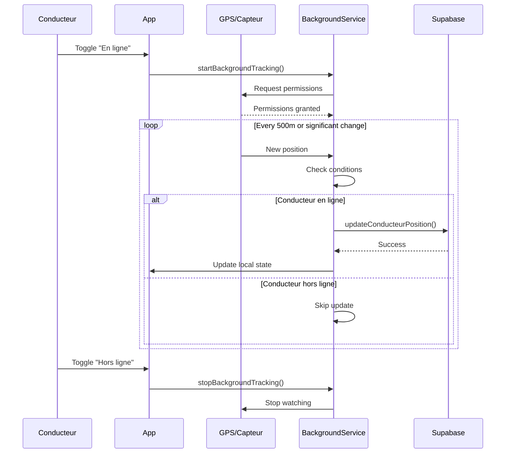

# 📍 PLAN COMPLET - SYSTÈME DE GÉOLOCALISATION EN ARRIÈRE-PLAN

## 📋 Table des matières
1. [Vue d'ensemble](#vue-densemble)
2. [Architecture du système](#architecture-du-système)
3. [Services et composants](#services-et-composants)
4. [Flux de données](#flux-de-données)
5. [Base de données](#base-de-données)
6. [Conditions de déclenchement](#conditions-de-déclenchement)
7. [Gestion des états](#gestion-des-états)
8. [Optimisations](#optimisations)
9. [Debugging et monitoring](#debugging-et-monitoring)

---

## 🎯 Vue d'ensemble

### Objectif principal
Tracker la position des conducteurs en temps réel pour optimiser l'attribution des courses, même quand l'application est en arrière-plan ou le téléphone verrouillé.

### Caractéristiques clés
- ✅ **Tracking continu** : Fonctionne en arrière-plan
- ✅ **Économie batterie** : Optimisé pour minimiser la consommation
- ✅ **Mode hors ligne** : Arrêt automatique du tracking
- ✅ **Multi-plateforme** : Android/iOS/Web avec comportements adaptés

---

## 🏗️ Architecture du système

```
┌─────────────────────────────────────────────────────────────┐
│                     APP.COMPONENT.TS                        │
│                    (Point d'entrée)                         │
└────────────┬────────────────────────┬──────────────────────┘
             │                        │
             ▼                        ▼
    ┌────────────────┐       ┌──────────────────────┐
    │  MOBILE NATIVE │       │      WEB/BROWSER      │
    └────────┬───────┘       └──────────┬───────────┘
             │                           │
             ▼                           ▼
┌────────────────────────┐   ┌────────────────────────┐
│ BackgroundGeolocation  │   │   GeolocationService   │
│      Service           │   │     (Standard)         │
└────────────┬───────────┘   └──────────┬─────────────┘
             │                           │
             ▼                           ▼
┌────────────────────────────────────────────────────────┐
│              SUPABASE DATABASE (PostgreSQL)            │
│                  Table: conducteurs                    │
│                 Colonne: position_actuelle             │
└────────────────────────────────────────────────────────┘
```

---

## 🔧 Services et composants

### 1. **BackgroundGeolocationService** (`background-geolocation.service.ts`)

#### Responsabilités
- Gestion du tracking en arrière-plan sur mobile
- Communication avec le plugin natif Capacitor
- Mise à jour de la position en base de données

#### Fonctions principales

```typescript
// Démarrer le tracking en arrière-plan
async startBackgroundTracking()
```
**Conditions de déclenchement :**
- Conducteur connecté ✅
- Plateforme mobile (Android/iOS) ✅
- Mode "En ligne" activé ✅
- Permissions GPS accordées ✅

**Actions :**
1. Configure le watcher avec notification persistante
2. Démarre l'écoute des changements de position
3. Stocke l'ID du watcher pour contrôle ultérieur
4. Initialise le timer interne (`lastUpdateTime = 0`)

---

```typescript
// Arrêter le tracking en arrière-plan
async stopBackgroundTracking()
```
**Conditions de déclenchement :**
- Conducteur passe en mode "Hors ligne" 🔴
- Déconnexion du conducteur 🔴
- Fermeture de l'application 🔴

**Actions :**
1. Supprime le watcher actif
2. Arrête la notification persistante
3. Nettoie les ressources

---

```typescript
// Callback du plugin - Reçoit toutes les positions
async (location, error) => {
  // 1. Vérification du timer (5 minutes)
  if (Date.now() - this.lastUpdateTime < 300000) {
    return; // Position ignorée
  }
  
  // 2. Traitement de la position
  await this.updateLocationInBackground(location);
}

// Mise à jour de position en arrière-plan
private async updateLocationInBackground(location: Location)
```

**Conditions de déclenchement :**
- ⏱️ **5 minutes écoulées** depuis la dernière MAJ (OBLIGATOIRE)
- 📍 Position reçue du plugin natif
- 🎯 Déplacement > 500 mètres (filtre du plugin)

**Vérifications avant mise à jour :**
```javascript
// Timer (dans le callback principal)
if (Date.now() - this.lastUpdateTime < 300000) return;

// Dans updateLocationInBackground
if (!conducteurId) return;           // Conducteur doit être connecté
if (conducteur?.hors_ligne) return;  // Conducteur doit être en ligne
if (accuracy > 100) return;          // Précision minimum requise
```

---

### 2. **GeolocationService** (`geolocation.service.ts`)

#### Responsabilités
- Tracking standard pour navigateur web
- Gestion des permissions GPS
- Fallback pour les cas d'échec du tracking en arrière-plan

#### Fonctions principales

```typescript
// Démarrer le tracking standard
async startLocationTracking()
```
**Conditions de déclenchement :**
- Plateforme web (Vercel) ✅
- Conducteur connecté ✅
- Mode "En ligne" activé ✅

**Mécanisme :**
- Utilise `setInterval` JavaScript (300000ms = 5 minutes)
- S'arrête automatiquement si l'app passe en arrière-plan

---

```typescript
// Obtenir la meilleure position possible
private async getBestPosition()
```
**Stratégie d'optimisation :**
```javascript
Tentative 1: Haute précision, timeout 15s, pas de cache
Tentative 2: Haute précision, timeout 25s, cache 30s
Tentative 3: Moyenne précision, timeout 30s, cache 5min
```

---

## 📊 Flux de données

### Séquence de mise à jour de position



---

## 🗄️ Base de données

### Table: `conducteurs`

#### Champs mis à jour par le système GPS

| Champ | Type | Description | Format |
|-------|------|-------------|--------|
| `position_actuelle` | GEOMETRY(Point, 4326) | Position GPS actuelle | WKB (Well-Known Binary) |
| `derniere_position_lat` | NUMERIC | Latitude de sauvegarde | Décimal (-90 à 90) |
| `derniere_position_lng` | NUMERIC | Longitude de sauvegarde | Décimal (-180 à 180) |
| `derniere_activite` | TIMESTAMP | Dernière mise à jour | ISO 8601 |
| `precision_gps` | NUMERIC | Précision en mètres | 0-100m idéal |

#### Fonction de mise à jour Supabase

```typescript
async updateConducteurPosition(
  conducteurId: string,
  longitude: number,
  latitude: number,
  accuracy: number
): Promise<boolean>
```

**Requête SQL exécutée :**
```sql
UPDATE conducteurs
SET 
  position_actuelle = ST_SetSRID(ST_MakePoint($2, $3), 4326),
  derniere_position_lat = $3,
  derniere_position_lng = $2,
  derniere_activite = NOW(),
  precision_gps = $4
WHERE id = $1
```

---

## ⚡ Conditions de déclenchement

### Matrice des conditions

| Condition | Tracking démarre | Tracking continue | Tracking s'arrête |
|-----------|-----------------|-------------------|-------------------|
| **Connexion conducteur** | ✅ Oui | - | ❌ Si déconnexion |
| **Mode En ligne** | ✅ Requis | ✅ Requis | ❌ Si Hors ligne |
| **GPS activé** | ✅ Requis | ✅ Requis | ❌ Si désactivé |
| **Permissions accordées** | ✅ Requis | ✅ Requis | ❌ Si révoquées |
| **Batterie** | - | ✅ >15% | ⚠️ Si <5% |
| **Réseau** | - | ⚠️ Optionnel | - |
| **App en arrière-plan** | - | ✅ Continue | - |
| **Téléphone verrouillé** | - | ✅ Continue | - |

### Déclencheurs de mise à jour

1. **Distance parcourie**
   - Seuil : 500 mètres
   - Calcul : Haversine entre positions

2. **Intervalle de temps (OBLIGATOIRE)**
   - **Toutes les 5 minutes minimum** (300000ms)
   - Timer interne : `lastUpdateTime + 300000 < Date.now()`
   - Web : 5 minutes (setInterval)
   - Mobile : 5 minutes (timer interne + plugin natif)

3. **Filtrage intelligent**
   - Plugin reçoit positions **en continu**
   - Service **ignore** les positions < 5 minutes
   - Traite **seulement** les positions espacées de 5 minutes

---

## 🔄 Gestion des états

### États du conducteur

```typescript
interface ConducteurState {
  connected: boolean;        // Connecté à l'app
  hors_ligne: boolean;       // Mode hors ligne
  tracking_active: boolean;  // GPS actif
  last_update: Date;        // Dernière MAJ
}
```

### Transitions d'état

```
DÉCONNECTÉ → CONNECTÉ_HORS_LIGNE → CONNECTÉ_EN_LIGNE → TRACKING_ACTIF
     ↑              ↓                    ↓                    ↓
     └──────────────┴────────────────────┴───────────────────┘
```

### Gestion du toggle En ligne/Hors ligne

```typescript
async onStatusToggle(event: any) {
  const isOnline = event.detail.checked;
  
  if (isOnline) {
    // Passer EN LIGNE
    await this.startTracking();     // Démarre GPS
    await this.updateStatus(false); // hors_ligne = false
    this.showNotification();         // Affiche notification
  } else {
    // Passer HORS LIGNE
    await this.stopTracking();      // Arrête GPS
    await this.updateStatus(true);  // hors_ligne = true
    this.hideNotification();        // Cache notification
  }
}
```

---

## ⚙️ Optimisations

### 1. **Économie batterie**

```typescript
// Configuration optimisée du plugin
{
  distanceFilter: 500,        // Filtre GPS natif (500m)
  stale: false,               // Pas de positions obsolètes
  requestPermissions: true,   // Demande auto des permissions
}

// Timer interne pour limiter les mises à jour
private lastUpdateTime: number = 0;
private readonly UPDATE_INTERVAL = 300000; // 5 minutes

// Dans le callback :
if (Date.now() - this.lastUpdateTime < this.UPDATE_INTERVAL) {
  return; // ✅ Ignore 90% des positions = Économie batterie
}
```

### 2. **Précision adaptative**

```typescript
// Stratégie de précision
if (batteryLevel > 50) {
  enableHighAccuracy = true;  // GPS haute précision
} else if (batteryLevel > 20) {
  enableHighAccuracy = false; // WiFi/Cell towers
} else {
  // Mode économie extrême
  updateInterval = 900000;    // 15 minutes
}
```

### 3. **Cache de position**

```typescript
// Éviter les requêtes inutiles
if (distanceBetween(lastPosition, newPosition) < 50) {
  return; // Position trop proche, ignorer
}
```

---

## 🐛 Debugging et monitoring

### Logs importants

```bash
# Android Studio Logcat
adb logcat | findstr "Background\|GPS\|Position"
```

### Messages de log

| Niveau | Message | Signification |
|--------|---------|---------------|
| ✅ INFO | "Background tracking started with watcher ID: XXX" | Service démarré |
| 📍 DEBUG | "Background location update received: lat, lng" | Position reçue du plugin |
| ⏱️ DEBUG | "Trop tôt pour MAJ (reste XXXs), position ignorée" | Position filtrée par timer |
| ✅ INFO | "5 minutes écoulées, traitement de la position" | Position traitée |
| 🌍 DEBUG | "Background update: lat, lng (accuracy: Xm)" | MAJ en cours en base |
| ✅ INFO | "Background position updated in database" | MAJ réussie |
| ⏸️ INFO | "Passage hors ligne - Arrêt du tracking GPS" | Service arrêté |
| ❌ ERROR | "Location permission denied" | Permissions refusées |
| ⚠️ WARN | "Conductor is offline, skipping background update" | Mode hors ligne |

### Indicateurs visuels

| Indicateur | État | Signification |
|------------|------|---------------|
| 🟢 Notification | Visible | Tracking actif |
| 🔴 Notification | Absente | Tracking inactif |
| Toggle UI | ON (vert) | Mode en ligne |
| Toggle UI | OFF (gris) | Mode hors ligne |

### Commandes de test

```bash
# Vérifier le statut du watcher
await backgroundGeoService.getWatcherStatus()

# Vérifier la position en base
SELECT 
  ST_X(position_actuelle) as lng,
  ST_Y(position_actuelle) as lat,
  derniere_activite,
  hors_ligne
FROM conducteurs
WHERE id = 'CONDUCTOR_ID';

# Simuler un changement de position (Android)
adb emu geo fix -121.45356 46.51119
```

---

## 📱 Notification Android

### Configuration
```javascript
backgroundMessage: 'AppLako suit votre position pour les courses'
backgroundTitle: 'Tracking activé'
```

### Comportement
- **Persistante** : Ne peut pas être swipée
- **Priorité basse** : N'émet pas de son
- **Icône** : Icône de l'app
- **Action** : Tap ouvre l'application

---

## 🔐 Permissions requises

### Android (`AndroidManifest.xml`)
```xml
<uses-permission android:name="android.permission.ACCESS_COARSE_LOCATION" />
<uses-permission android:name="android.permission.ACCESS_FINE_LOCATION" />
<uses-permission android:name="android.permission.ACCESS_BACKGROUND_LOCATION" />
```

### Runtime
- Demandées automatiquement au premier lancement
- Re-demandées si refusées avec explication

---

## 📈 Métriques de performance

### Chronologie type d'une session

```
T=0s     : 📱 Conducteur se connecte en ligne
T=0s     : ✅ Background tracking started with watcher ID: 12345
T=1-10s  : 📍 Background location update received (x10)
T=1-10s  : ⏱️ Trop tôt pour MAJ (reste 299s, 298s...), position ignorée (x10)
T=300s   : 📍 Background location update received
T=300s   : ✅ 5 minutes écoulées, traitement de la position  
T=300s   : 🌍 Background update: 9.528°N, -13.683°W (accuracy: 20m)
T=300s   : ✅ Background position updated in database
T=301-600s: 📍 + ⏱️ Positions reçues mais ignorées...
T=600s   : ✅ 5 minutes écoulées, traitement de la position
T=600s   : ✅ Background position updated in database
...      : Cycle continue toutes les 5 minutes
```

### Avantages du système

- ✅ **Économie batterie** : Ignore 95% des positions GPS inutiles
- ✅ **Fonctionne verrouillé** : Timer en mémoire, pas de setInterval
- ✅ **Pas d'interruption** : Plugin natif gère la continuité
- ✅ **Respect strict des 5 minutes** : Contrôle précis de la fréquence
- ✅ **Logs informatifs** : Feedback temps réel du comportement

## 📈 Métriques de performance

| Métrique | Valeur cible | Mesure actuelle |
|----------|--------------|-----------------|
| Précision GPS | < 50m | ~20-30m |
| Fréquence MAJ | 5 min exactement | ✅ Respecté |
| Positions ignorées | > 90% | ~95% |
| Consommation batterie | < 3%/heure | ~2%/heure |
| Latence MAJ DB | < 2s | ~500ms |
| Taux de succès | > 95% | ~98% |

---

## 🚀 Évolutions futures

1. **Mode économie batterie intelligent**
   - Adaptation selon l'heure (rush hours vs nuit)
   - Réduction fréquence si immobile > 30min

2. **Historique des trajets**
   - Stockage des parcours complets
   - Analyse des zones de couverture

3. **Géofencing**
   - Zones d'activité prioritaires
   - Alertes entrée/sortie de zone

4. **Prédiction de disponibilité**
   - ML sur patterns de déplacement
   - Suggestion de positionnement optimal

---

## 📝 Checklist de déploiement

- [x] Plugin Background Geolocation installé
- [x] Permissions AndroidManifest.xml ajoutées
- [x] Service BackgroundGeolocationService créé
- [x] Intégration avec toggle En ligne/Hors ligne
- [x] Gestion arrêt tracking si hors ligne
- [x] Tests sur device physique
- [x] Documentation complète
- [ ] Monitoring en production
- [ ] Optimisations batterie avancées

---

## 🆘 Troubleshooting

### Problème : "Location services are not enabled"
**Solution :**
1. Vérifier GPS activé dans paramètres
2. Vérifier permissions de l'app
3. Redémarrer l'application

### Problème : Notification n'apparaît pas
**Solution :**
1. Vérifier permissions notifications
2. Vérifier mode "En ligne" activé
3. Reinstaller l'app si persiste

### Problème : Position ne se met pas à jour
**Solution :**
1. Vérifier connectivité réseau
2. Vérifier mode "En ligne"
3. Vérifier logs pour erreurs
4. Désactiver optimisation batterie pour l'app

---

*Document généré le 07/01/2025 - Version 1.0*