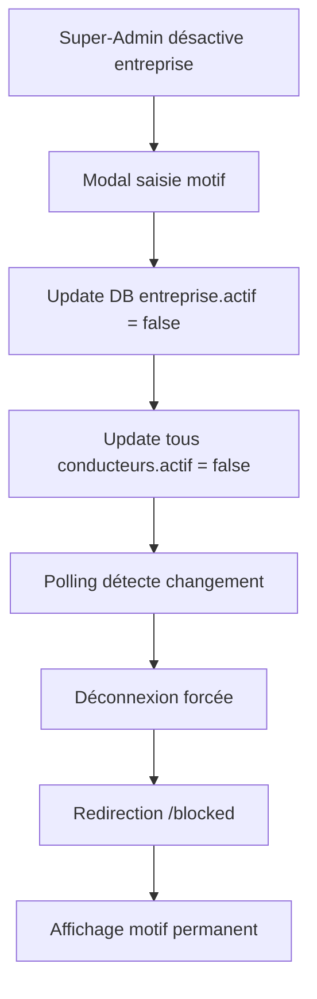
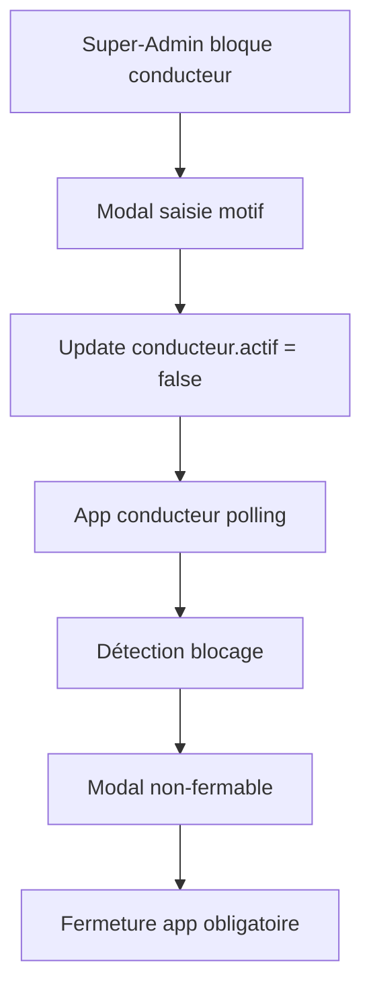

# Plan Système de Blocage Entreprise et Conducteurs

## 📋 Vue d'ensemble
Système de désactivation à deux niveaux permettant de bloquer une entreprise entière ou des conducteurs individuellement, avec déconnexion automatique et affichage permanent du motif de blocage.

## 1. Modifications Base de Données

### Table `entreprises` - Ajouter :
```sql
ALTER TABLE entreprises ADD COLUMN motif_desactivation TEXT;
ALTER TABLE entreprises ADD COLUMN date_desactivation TIMESTAMP;
ALTER TABLE entreprises ADD COLUMN desactive_par TEXT;
```

### Table `conducteurs` - Ajouter :
```sql
ALTER TABLE conducteurs ADD COLUMN motif_blocage TEXT;
ALTER TABLE conducteurs ADD COLUMN date_blocage TIMESTAMP;
ALTER TABLE conducteurs ADD COLUMN bloque_par TEXT; -- 'entreprise', 'super-admin', 'super-admin-entreprise'
```

### Table `historique_blocages` - Créer :
```sql
CREATE TABLE historique_blocages (
  id UUID DEFAULT uuid_generate_v4() PRIMARY KEY,
  type VARCHAR(20) CHECK (type IN ('entreprise', 'conducteur')),
  entite_id UUID NOT NULL,
  action VARCHAR(20) CHECK (action IN ('bloquer', 'debloquer')),
  motif TEXT,
  par TEXT,
  date TIMESTAMP DEFAULT NOW()
);
```

## 2. Système de Désactivation à 3 Niveaux

### Niveau 1 : Désactivation Entreprise (par Super-Admin)
- Désactive automatiquement TOUS les conducteurs de l'entreprise
- Motif global appliqué à tous les conducteurs
- Déconnexion immédiate de tous les utilisateurs
- `bloque_par = 'super-admin-entreprise'`

### Niveau 2 : Désactivation Conducteur par Super-Admin
- Désactivation individuelle d'un conducteur spécifique
- Motif personnalisé pour le conducteur
- Le conducteur reste bloqué même si l'entreprise est réactivée
- `bloque_par = 'super-admin'`

### Niveau 3 : Désactivation Conducteur par Entreprise
- L'entreprise peut bloquer ses propres conducteurs
- Motif spécifique défini par l'entreprise
- Gestion autonome par l'entreprise
- `bloque_par = 'entreprise'`

## 3. Interfaces d'Administration

### A. Interface Super-Admin

#### Désactivation Entreprise
```typescript
interface DesactivationEntrepriseData {
  entrepriseId: string;
  motif: string;
  desactiverConducteurs: boolean;
  dateDesactivation: Date;
  desactivePar: string;
}
```

**Workflow :**
1. Toggle sur le statut entreprise
2. Modal de confirmation avec :
   - Textarea pour le motif (obligatoire)
   - Checkbox "Désactiver aussi tous les conducteurs"
   - Bouton "Confirmer la désactivation"
3. Mise à jour base de données
4. Déconnexion forcée de tous les utilisateurs

#### Désactivation Conducteur par Super-Admin
```typescript
interface BlocageConducteurData {
  conducteurId: string;
  motif: string;
  raison: 'comportement' | 'documents' | 'demande_entreprise' | 'autre';
  dateBlocage: Date;
  bloquePar: string;
}
```

**Workflow :**
1. Bouton blocage dans la liste des conducteurs
2. Modal avec :
   - Radio buttons pour la raison
   - Textarea pour le motif détaillé
   - Bouton "Bloquer le conducteur"
3. Mise à jour du conducteur avec `bloque_par = 'super-admin'`
4. Déconnexion immédiate si connecté

### B. Interface Entreprise

#### Gestion Conducteurs (`/entreprise/conducteurs`)
```typescript
interface BlocageConducteurEntreprise {
  conducteurId: string;
  motif: string;
  raison: 'absence' | 'comportement' | 'documents' | 'temporaire' | 'autre';
  duree?: 'temporaire' | 'indefini';
  dateFin?: Date; // Si temporaire
  dateBlocage: Date;
}
```

**Workflow :**
1. Page liste des conducteurs de l'entreprise
2. Bouton toggle actif/inactif pour chaque conducteur
3. Modal de blocage avec :
   - Radio buttons pour la raison
   - Option durée (temporaire/indéfini)
   - Date de fin si temporaire
   - Textarea pour le motif
4. Mise à jour avec `bloque_par = 'entreprise'`
5. Notification au conducteur

**Interface Entreprise - Liste Conducteurs :**
```html
<ion-list>
  <ion-item *ngFor="let conducteur of conducteurs">
    <ion-label>
      <h2>{{ conducteur.nom }} {{ conducteur.prenom }}</h2>
      <p>{{ conducteur.telephone }}</p>
      <ion-badge [color]="conducteur.actif ? 'success' : 'danger'">
        {{ conducteur.actif ? 'Actif' : getMotifBlocage(conducteur) }}
      </ion-badge>
    </ion-label>
    <ion-toggle 
      [checked]="conducteur.actif"
      (ionChange)="toggleConducteurStatus(conducteur, $event)">
    </ion-toggle>
  </ion-item>
</ion-list>
```

## 4. Service de Vérification (Sans RLS)

### BlockageService
```typescript
export class BlockageService {
  private checkInterval: any;
  
  startMonitoring() {
    // Vérification toutes les 30 secondes
    this.checkInterval = setInterval(() => {
      this.checkBlockageStatus();
    }, 30000);
  }
  
  async checkBlockageStatus() {
    // Vérifier statut entreprise
    const entreprise = await this.getEntrepriseStatus();
    if (!entreprise.actif) {
      this.handleEntrepriseBlocked(entreprise.motif_desactivation);
      return;
    }
    
    // Vérifier statut conducteur
    const conducteur = await this.getConducteurStatus();
    if (!conducteur.actif) {
      this.handleConducteurBlocked(conducteur.motif_blocage);
      return;
    }
  }
  
  private handleEntrepriseBlocked(motif: string) {
    localStorage.clear();
    sessionStorage.clear();
    this.router.navigate(['/blocked'], { 
      queryParams: { motif, type: 'entreprise' } 
    });
  }
  
  private handleConducteurBlocked(motif: string) {
    this.showBlockedModal(motif);
  }
}
```

## 5. Logique de Blocage en Cascade

### Désactivation Entreprise
```
Entreprise désactivée par Super-Admin
    ↓
UPDATE conducteurs 
SET actif = false, 
    motif_blocage = entreprise.motif_desactivation,
    bloque_par = 'super-admin-entreprise',
    date_blocage = NOW()
WHERE entreprise_id = X
    ↓
Déconnexion de tous les utilisateurs
```

### Réactivation Entreprise
```
Entreprise réactivée
    ↓
UPDATE conducteurs 
SET actif = true,
    motif_blocage = NULL,
    date_blocage = NULL
WHERE entreprise_id = X 
AND bloque_par = 'super-admin-entreprise'  -- Ne pas débloquer les blocages individuels
```

### Blocage Conducteur par Entreprise
```
Entreprise bloque son conducteur
    ↓
UPDATE conducteurs
SET actif = false,
    motif_blocage = 'Motif défini par entreprise',
    bloque_par = 'entreprise',
    date_blocage = NOW()
WHERE id = conducteur_id
AND entreprise_id = current_entreprise_id  -- Sécurité: seulement ses conducteurs
```

## 6. Pages et Modals de Blocage

### Page Entreprise Bloquée (`/entreprise/blocked`)
```html
<ion-content>
  <div class="blocked-container">
    <ion-card class="blocked-card">
      <ion-card-header>
        <ion-icon name="lock-closed" color="danger" size="large"></ion-icon>
        <ion-card-title>Compte Entreprise Désactivé</ion-card-title>
      </ion-card-header>
      
      <ion-card-content>
        <div class="motif-section">
          <h4>Motif de désactivation :</h4>
          <div class="motif-box">
            <p>{{ motif_desactivation }}</p>
          </div>
        </div>
        
        <div class="info-section">
          <p class="date">
            <ion-icon name="calendar-outline"></ion-icon>
            Désactivé le : {{ date_desactivation | date:'dd/MM/yyyy à HH:mm' }}
          </p>
        </div>
        
        <div class="actions">
          <ion-button expand="block" fill="outline" (click)="contactSupport()">
            <ion-icon name="call-outline" slot="start"></ion-icon>
            Contacter le support
          </ion-button>
        </div>
      </ion-card-content>
    </ion-card>
  </div>
</ion-content>
```

### Modal Conducteur Bloqué (Non-fermable)
```html
<ion-modal 
  [isOpen]="isBlocked" 
  [backdropDismiss]="false" 
  [canDismiss]="false"
  class="blocked-modal">
  
  <ion-content>
    <div class="blocked-content">
      <div class="blocked-header">
        <ion-icon name="ban" color="danger"></ion-icon>
        <h2>Compte Conducteur Bloqué</h2>
      </div>
      
      <div class="blocked-body">
        <div class="reason-section">
          <h4>Raison du blocage :</h4>
          <p class="reason-text">{{ motif_blocage }}</p>
        </div>
        
        <div class="info-section">
          <p class="blocked-by">
            <strong>Bloqué par :</strong> 
            {{ getBlockedByLabel(bloque_par) }}
          </p>
          <p class="blocked-date">
            <strong>Date :</strong> 
            {{ date_blocage | date:'dd/MM/yyyy à HH:mm' }}
          </p>
        </div>
      </div>
      
      <div class="blocked-footer">
        <ion-button expand="block" color="medium" (click)="closeApp()">
          Fermer l'application
        </ion-button>
      </div>
    </div>
  </ion-content>
</ion-modal>
```

## 7. AuthGuard et Intercepteur

### AuthGuard
```typescript
export class AuthGuard implements CanActivate {
  async canActivate(): Promise<boolean> {
    // Vérifier entreprise
    const entreprise = await this.entrepriseService.getCurrentEntreprise();
    if (entreprise && !entreprise.actif) {
      localStorage.setItem('blocage_motif', entreprise.motif_desactivation);
      localStorage.setItem('blocage_type', 'entreprise');
      this.router.navigate(['/blocked']);
      return false;
    }
    
    // Vérifier conducteur
    const conducteur = await this.conducteurService.getCurrentConducteur();
    if (conducteur && !conducteur.actif) {
      this.blockageService.showBlockedModal(conducteur.motif_blocage);
      return false;
    }
    
    return true;
  }
}
```

### HTTP Interceptor
```typescript
export class BlockageInterceptor implements HttpInterceptor {
  intercept(req: HttpRequest<any>, next: HttpHandler): Observable<HttpEvent<any>> {
    return next.handle(req).pipe(
      catchError((error: HttpErrorResponse) => {
        if (error.status === 403 && error.error.code === 'ENTREPRISE_BLOCKED') {
          this.handleBlockage(error.error.motif);
        }
        return throwError(error);
      })
    );
  }
}
```

## 8. Gestion des Cas Particuliers

| Scénario | Action | Résultat | Bloque_par |
|----------|--------|----------|------------|
| Entreprise désactivée par Super-Admin | Tous conducteurs bloqués automatiquement | Message du motif entreprise | `super-admin-entreprise` |
| Entreprise réactivée | Débloquer uniquement avec `bloque_par = 'super-admin-entreprise'` | Les blocages individuels restent | - |
| Conducteur bloqué par Super-Admin | Reste bloqué indépendamment | Même si entreprise active | `super-admin` |
| Conducteur bloqué par Entreprise | Entreprise peut débloquer | Gestion autonome | `entreprise` |
| Double blocage | Afficher le blocage le plus restrictif | Priorité : super-admin > entreprise | - |
| Entreprise bloque ses conducteurs | Seulement ses propres conducteurs | Vérification entreprise_id | `entreprise` |
| Tentative connexion après blocage | Refus immédiat | Affichage du motif selon bloque_par | - |

## 9. Workflow Complet

### Désactivation Entreprise


### Désactivation Conducteur


## 10. Configuration et Constantes

```typescript
// config/blocage.config.ts
export const BLOCAGE_CONFIG = {
  POLLING_INTERVAL: 30000, // 30 secondes
  RAISONS_BLOCAGE: {
    COMPORTEMENT: 'Comportement inapproprié',
    DOCUMENTS: 'Documents expirés ou invalides',
    DEMANDE_ENTREPRISE: 'Demande de l\'entreprise',
    AUTRE: 'Autre raison'
  },
  MESSAGES: {
    ENTREPRISE_BLOQUEE: 'Votre entreprise a été désactivée',
    CONDUCTEUR_BLOQUE: 'Votre compte a été bloqué',
    CONTACT_SUPPORT: 'Veuillez contacter le support pour plus d\'informations'
  }
};
```

## 11. Tests à Effectuer

### Tests Unitaires
- [ ] Service de blocage
- [ ] Guards et intercepteurs
- [ ] Méthodes de vérification

### Tests d'Intégration
- [ ] Désactivation entreprise → Déconnexion tous conducteurs
- [ ] Désactivation conducteur individuel
- [ ] Réactivation entreprise avec conducteurs bloqués individuellement
- [ ] Polling et détection de changements
- [ ] Affichage des motifs

### Tests E2E
- [ ] Workflow complet de désactivation
- [ ] Tentative de reconnexion après blocage
- [ ] Navigation vers pages bloquées
- [ ] Persistance du blocage

## 12. Sécurité

- Validation côté serveur de tous les changements de statut
- Logs de toutes les actions de blocage/déblocage
- Impossibilité de contourner le blocage côté client
- Token invalidé lors du blocage
- Historique complet des actions

## 13. Permissions et Sécurité

### Règles de Permissions

| Acteur | Peut bloquer | Peut débloquer | Conditions |
|--------|--------------|----------------|------------|
| **Super-Admin** | - Entreprises<br>- Tous conducteurs | - Entreprises<br>- Tous conducteurs | Sans restriction |
| **Entreprise** | - Ses propres conducteurs | - Ses conducteurs bloqués par elle-même | Vérification `entreprise_id` |
| **Conducteur** | Personne | Personne | Lecture seule de son statut |

### Vérifications de Sécurité

```typescript
// Service de blocage entreprise
async bloquerConducteur(conducteurId: string, motif: string) {
  // Vérifier que le conducteur appartient à l'entreprise
  const conducteur = await this.getConducteur(conducteurId);
  const entrepriseId = this.authService.getCurrentEntrepriseId();
  
  if (conducteur.entreprise_id !== entrepriseId) {
    throw new Error('Non autorisé: conducteur d\'une autre entreprise');
  }
  
  // Vérifier que l'entreprise n'est pas elle-même bloquée
  const entreprise = await this.getEntreprise(entrepriseId);
  if (!entreprise.actif) {
    throw new Error('Entreprise désactivée: impossible de gérer les conducteurs');
  }
  
  // Procéder au blocage
  return this.updateConducteur(conducteurId, {
    actif: false,
    motif_blocage: motif,
    bloque_par: 'entreprise',
    date_blocage: new Date()
  });
}
```

### Méthode Helper pour Labels

```typescript
// Helpers pour l'affichage
getBlockedByLabel(bloquePar: string): string {
  switch(bloquePar) {
    case 'super-admin':
      return 'Administrateur système';
    case 'super-admin-entreprise':
      return 'Administrateur (désactivation entreprise)';
    case 'entreprise':
      return 'Votre entreprise';
    default:
      return 'Non spécifié';
  }
}

canEntrepriseUnblock(conducteur: any): boolean {
  // L'entreprise peut débloquer seulement si elle a bloqué
  return conducteur.bloque_par === 'entreprise';
}

canSuperAdminUnblock(conducteur: any): boolean {
  // Super-admin peut tout débloquer
  return true;
}
```

## 14. Services Entreprise pour Gestion Conducteurs

```typescript
// entreprise-conducteur-management.service.ts
export class EntrepriseConducteurManagementService {
  
  async getMesConducteurs(): Promise<Conducteur[]> {
    const entrepriseId = this.authService.getCurrentEntrepriseId();
    return this.supabase.client
      .from('conducteurs')
      .select('*')
      .eq('entreprise_id', entrepriseId)
      .order('created_at', { ascending: false });
  }
  
  async toggleConducteurStatus(conducteurId: string, actif: boolean): Promise<void> {
    if (!actif) {
      // Blocage - demander motif
      return this.bloquerConducteur(conducteurId);
    } else {
      // Déblocage - vérifier permissions
      return this.debloquerConducteur(conducteurId);
    }
  }
  
  async bloquerConducteur(conducteurId: string, motif?: string): Promise<void> {
    const entrepriseId = this.authService.getCurrentEntrepriseId();
    
    // Vérifications de sécurité
    const conducteur = await this.verifyConducteurOwnership(conducteurId, entrepriseId);
    
    await this.supabase.client
      .from('conducteurs')
      .update({
        actif: false,
        motif_blocage: motif || 'Bloqué par l\'entreprise',
        bloque_par: 'entreprise',
        date_blocage: new Date().toISOString()
      })
      .eq('id', conducteurId)
      .eq('entreprise_id', entrepriseId); // Double sécurité
      
    // Ajouter à l'historique
    await this.addToHistorique(conducteurId, 'bloquer', motif);
  }
  
  async debloquerConducteur(conducteurId: string): Promise<void> {
    const entrepriseId = this.authService.getCurrentEntrepriseId();
    
    // Vérifier que c'est bien l'entreprise qui a bloqué
    const { data: conducteur } = await this.supabase.client
      .from('conducteurs')
      .select('bloque_par')
      .eq('id', conducteurId)
      .eq('entreprise_id', entrepriseId)
      .single();
      
    if (conducteur.bloque_par !== 'entreprise') {
      throw new Error('Impossible de débloquer: bloqué par ' + conducteur.bloque_par);
    }
    
    await this.supabase.client
      .from('conducteurs')
      .update({
        actif: true,
        motif_blocage: null,
        bloque_par: null,
        date_blocage: null
      })
      .eq('id', conducteurId)
      .eq('entreprise_id', entrepriseId);
      
    // Ajouter à l'historique
    await this.addToHistorique(conducteurId, 'debloquer', 'Débloqué par l\'entreprise');
  }
}
```

## 15. Améliorations Futures

- [ ] Notifications push lors du blocage
- [ ] Email automatique avec le motif
- [ ] Dashboard statistiques des blocages
- [ ] Système d'avertissement avant blocage
- [ ] API webhook pour notifications externes
- [ ] Blocage temporaire avec date de fin automatique
- [ ] Historique complet consultable par entreprise
- [ ] Export des blocages en CSV/PDF

---

## 16. 📋 IMPLÉMENTATION COMPLÈTE - ÉTAT ACTUEL

### ✅ **Fonctionnalités Implémentées**

#### 🗄️ **Base de Données**
- ✅ **Migration complète** : `database/migrations/001_blocage_system.sql`
- ✅ **Tables modifiées** : `entreprises` + `conducteurs` + `historique_blocages`
- ✅ **Triggers PostgreSQL** : Blocage automatique en cascade
- ✅ **Contraintes** : `bloque_par` avec validation

#### 🛠️ **Services Backend**
- ✅ **BlockageService** : Monitoring automatique toutes les 30 secondes
- ✅ **AppInitBlocageService** : Initialisation automatique au démarrage
- ✅ **ConducteurBlockedModalService** : Gestion des modals de blocage
- ✅ **AuthGuard + Interceptor** : Protection des routes et requêtes

#### 👨‍💼 **Interface Super-Admin**
- ✅ **Désactivation entreprise** : Modal moderne avec validation
- ✅ **Blocage conducteur simplifié** : Raison directe comme motif
- ✅ **Déblocage** : Gestion complète avec permissions
- ✅ **Interface moderne** : Headers primary, animations, validations

#### 🔄 **Système de Monitoring**
- ✅ **Monitoring dual** : Entreprises ET conducteurs
- ✅ **Polling 30 secondes** : Vérification automatique
- ✅ **Logs détaillés** : Traçabilité complète
- ✅ **Déconnexion forcée** : Session nettoyée automatiquement

#### 🎯 **Interface Conducteur Bloqué**
- ✅ **Système simplifié** : Plus de modal complexe
- ✅ **Message sur login** : Information claire et élégante
- ✅ **Design moderne** : Animation, couleurs cohérentes
- ✅ **Une seule apparition** : Évite le spam de notifications

### 🔧 **Détails Techniques Implémentés**

#### **1. Modal Blocage Conducteur Simplifiée**
```typescript
// Nouveau système : Déconnexion + message sur login
private async handleConducteurBlocked(motif: string, bloque_par?: string, date_blocage?: string): Promise<void> {
  // Sauvegarde motif dans localStorage
  const blocageInfo = {
    motif: motif,
    bloque_par: bloque_par || 'Administration',
    date_blocage: date_blocage || new Date().toISOString()
  };
  localStorage.setItem('conducteur_bloque_info', JSON.stringify(blocageInfo));
  
  // Déconnexion immédiate + redirection
  await this.conducteurAuth.logout();
  this.router.navigate(['/login'], { replaceUrl: true });
}
```

#### **2. Page de Login avec Message de Blocage**
```html
<div *ngIf="blockedInfo && userType === 'conducteur'" class="blocked-message">
  <div class="blocked-content">
    <div class="blocked-header">
      <ion-icon name="ban" class="blocked-icon"></ion-icon>
      <h3>Accès Bloqué</h3>
    </div>
    <div class="blocked-details">
      <p><strong>Motif :</strong> {{ blockedInfo.motif }}</p>
      <p><strong>Bloqué par :</strong> {{ blockedInfo.bloque_par }}</p>
    </div>
    <div class="blocked-actions">
      <p>Contactez l'administration pour plus d'informations.</p>
    </div>
  </div>
</div>
```

#### **3. Système de Blocage Simplifié (Super-Admin)**
```typescript
// Une seule modal : Sélection raison → Blocage direct
async onBloquerConducteur(conducteur: any) {
  const alert = await this.alertController.create({
    cssClass: 'custom-alert-blocage-conducteur-moderne',
    header: 'Blocage Conducteur',
    subHeader: `${conducteur.nom} ${conducteur.prenom}`,
    message: `Sélectionnez la raison du blocage:`,
    inputs: raisonsOptions.map((option, index) => ({
      name: 'raison',
      type: 'radio',
      label: `${this.getRaisonIcon(option.value)} ${option.label}`,
      value: option.value,
      checked: index === 0
    })),
    buttons: [{
      text: 'Bloquer le Conducteur',
      handler: (data) => {
        // Utilise directement la raison sélectionnée comme motif
        const motif = `${this.getRaisonIcon(data.raison)} ${raisonLabel}`;
        this.confirmerBlocageConducteur(conducteur, motif, data.raison);
        return true;
      }
    }]
  });
}
```

#### **4. Monitoring Automatique Activé**
```typescript
// Initialisation dans AppComponent.ngOnInit()
ngOnInit() {
  // Initialise le système de blocage
  this.blocageInitService.initialize();
  
  // Monitor entreprises ET conducteurs
  // Polling toutes les 30 secondes
  // Logs détaillés de toutes les actions
}
```

#### **5. Providers Ionic Ajoutés**
```typescript
// main.ts - Correction NullInjectorError
bootstrapApplication(AppComponent, {
  providers: [
    provideIonicAngular(),
    ModalController,
    AlertController,
    LoadingController,
    ToastController,
  ],
});
```

### 🎨 **Interface Utilisateur Moderne**

#### **Styles Implémentés**
- ✅ **Headers dégradé primary** : Couleurs de la charte
- ✅ **Animations fluides** : slideInBlocked, pulse-blocked
- ✅ **Design responsive** : Mobile et desktop
- ✅ **Messages clairs** : Sans code HTML visible
- ✅ **Validation élégante** : Toast personnalisés

### 📊 **Flow Utilisateur Final**

#### **Pour un Conducteur Bloqué :**
1. **Détection** (max 30 secondes)
2. **Déconnexion automatique** 
3. **Redirection** vers login
4. **Message informatif** élégant
5. **Impossibilité de se reconnecter**

#### **Pour un Super-Admin :**
1. **Clic sur icône blocage** 🚫
2. **Sélection raison** (radio buttons avec icônes)
3. **Blocage immédiat** (raison = motif)
4. **Confirmation** et mise à jour statut

### 🚀 **Résultat Final**

Le système de blocage est maintenant :
- ✅ **Complètement opérationnel**
- ✅ **Simple et intuitif** 
- ✅ **Visuellement cohérent**
- ✅ **Techniquement robuste**
- ✅ **Automatisé** (monitoring)
- ✅ **Sécurisé** (permissions + validation)

### 📝 **Corrections Importantes Apportées**

#### **Problèmes Résolus :**
1. ❌ Modal avec code HTML → ✅ Message propre sur login
2. ❌ Textarea invisible → ✅ Sélection directe raison = motif
3. ❌ Monitoring uniquement entreprises → ✅ Support complet conducteurs
4. ❌ NullInjectorError → ✅ Providers Ionic ajoutés
5. ❌ Design générique → ✅ Charte graphique respectée

#### **Améliorations Visuelles :**
- 🎨 Headers en couleur primary avec dégradés
- 🎯 Icônes expressives pour chaque raison
- ⚡ Animations d'entrée et de focus
- 📱 Interface responsive et moderne
- 🔄 Toast de validation avec styles personnalisés

### 🧪 **Tests à Effectuer**

#### **Test Rapide :**
1. **Bloquer** le conducteur "mamadou souaré balde" 
2. **Vérifier** sa déconnexion automatique (max 30s)
3. **Contrôler** l'affichage du message sur la page login
4. **Confirmer** l'impossibilité de se reconnecter

#### **Tests Avancés :**
- Blocage pendant qu'un conducteur utilise l'app
- Redémarrage de l'app après blocage
- Multiple blocages simultanés
- Déblocage et reconnexion

---

## 📋 **NOTES IMPORTANTES POUR CLAUDE**

### 🎯 **Règle de Documentation**
**Quand je demande de créer un doc XX.md, toutes les mises à jour doivent se faire dans XX.md. Il ne faut pas créer d'autres docs pour la même fonctionnalité.**

### 📁 **Fichiers de Documentation à Supprimer**
Les fichiers suivants sont des doublons et doivent être supprimés :
- `SIMPLIFICATION_BLOCAGE_CONDUCTEUR.md`
- `SYSTEME_BLOCAGE_SIMPLE.md`
- `ACTIVATION_MONITORING_CONDUCTEURS.md`
- `AMELIORATIONS_MODAL_BLOCAGE_CONDUCTEUR.md`
- `CORRECTIONS_MODALS_SUPER_ADMIN.md`

### 📄 **Fichiers de Documentation à Conserver**
- ✅ **PLAN_SYSTEME_BLOCAGE_ENTREPRISE_CONDUCTEUR.md** (PRINCIPAL)
- ✅ **PLAN_TESTS_SYSTEME_BLOCAGE.md** (Tests spécifiques)

**Note :** Ce fichier centralise maintenant TOUTE la documentation du système de blocage, depuis la planification initiale jusqu'à l'implémentation complète et les corrections apportées.