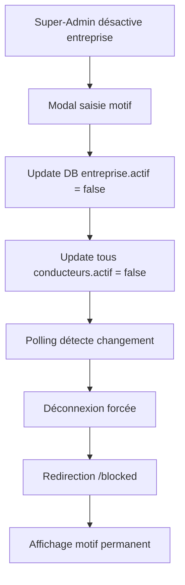
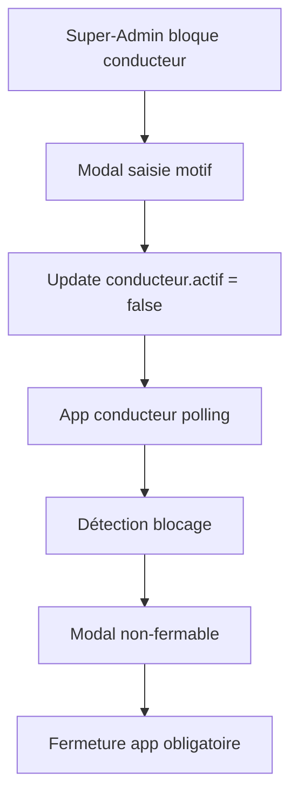

# Plan Système de Blocage Entreprise et Conducteurs

## 📋 Vue d'ensemble
Système de désactivation à deux niveaux permettant de bloquer une entreprise entière ou des conducteurs individuellement, avec déconnexion automatique et affichage permanent du motif de blocage.

## 1. Modifications Base de Données

### Table `entreprises` - Ajouter :
```sql
ALTER TABLE entreprises ADD COLUMN motif_desactivation TEXT;
ALTER TABLE entreprises ADD COLUMN date_desactivation TIMESTAMP;
ALTER TABLE entreprises ADD COLUMN desactive_par TEXT;
```

### Table `conducteurs` - Ajouter :
```sql
ALTER TABLE conducteurs ADD COLUMN motif_blocage TEXT;
ALTER TABLE conducteurs ADD COLUMN date_blocage TIMESTAMP;
ALTER TABLE conducteurs ADD COLUMN bloque_par TEXT; -- 'entreprise' ou 'super-admin'
```

### Table `historique_blocages` - Créer :
```sql
CREATE TABLE historique_blocages (
  id UUID DEFAULT uuid_generate_v4() PRIMARY KEY,
  type VARCHAR(20) CHECK (type IN ('entreprise', 'conducteur')),
  entite_id UUID NOT NULL,
  action VARCHAR(20) CHECK (action IN ('bloquer', 'debloquer')),
  motif TEXT,
  par TEXT,
  date TIMESTAMP DEFAULT NOW()
);
```

## 2. Système de Désactivation à 2 Niveaux

### Niveau 1 : Désactivation Entreprise
- Désactive automatiquement TOUS les conducteurs de l'entreprise
- Motif global appliqué à tous les conducteurs
- Déconnexion immédiate de tous les utilisateurs

### Niveau 2 : Désactivation Conducteur
- Désactivation individuelle d'un conducteur spécifique
- Motif personnalisé pour le conducteur
- Le conducteur reste bloqué même si l'entreprise est réactivée

## 3. Interface Super-Admin

### A. Désactivation Entreprise

#### Composant Modal
```typescript
interface DesactivationEntrepriseData {
  entrepriseId: string;
  motif: string;
  desactiverConducteurs: boolean;
  dateDesactivation: Date;
  desactivePar: string;
}
```

#### Workflow
1. Toggle sur le statut entreprise
2. Modal de confirmation avec :
   - Textarea pour le motif (obligatoire)
   - Checkbox "Désactiver aussi tous les conducteurs"
   - Bouton "Confirmer la désactivation"
3. Mise à jour base de données
4. Déconnexion forcée de tous les utilisateurs

### B. Désactivation Conducteur Individuel

#### Composant Modal
```typescript
interface BlocageConducteurData {
  conducteurId: string;
  motif: string;
  raison: 'comportement' | 'documents' | 'demande_entreprise' | 'autre';
  dateBlocage: Date;
  bloquePar: string;
}
```

#### Workflow
1. Bouton blocage dans la liste des conducteurs
2. Modal avec :
   - Radio buttons pour la raison
   - Textarea pour le motif détaillé
   - Bouton "Bloquer le conducteur"
3. Mise à jour du conducteur
4. Déconnexion immédiate si connecté

## 4. Service de Vérification (Sans RLS)

### BlockageService
```typescript
export class BlockageService {
  private checkInterval: any;
  
  startMonitoring() {
    // Vérification toutes les 30 secondes
    this.checkInterval = setInterval(() => {
      this.checkBlockageStatus();
    }, 30000);
  }
  
  async checkBlockageStatus() {
    // Vérifier statut entreprise
    const entreprise = await this.getEntrepriseStatus();
    if (!entreprise.actif) {
      this.handleEntrepriseBlocked(entreprise.motif_desactivation);
      return;
    }
    
    // Vérifier statut conducteur
    const conducteur = await this.getConducteurStatus();
    if (!conducteur.actif) {
      this.handleConducteurBlocked(conducteur.motif_blocage);
      return;
    }
  }
  
  private handleEntrepriseBlocked(motif: string) {
    localStorage.clear();
    sessionStorage.clear();
    this.router.navigate(['/blocked'], { 
      queryParams: { motif, type: 'entreprise' } 
    });
  }
  
  private handleConducteurBlocked(motif: string) {
    this.showBlockedModal(motif);
  }
}
```

## 5. Logique de Blocage en Cascade

### Désactivation Entreprise
```
Entreprise désactivée
    ↓
UPDATE conducteurs 
SET actif = false, 
    motif_blocage = entreprise.motif_desactivation,
    bloque_par = 'entreprise'
WHERE entreprise_id = X
    ↓
Déconnexion de tous les utilisateurs
```

### Réactivation Entreprise
```
Entreprise réactivée
    ↓
UPDATE conducteurs 
SET actif = true,
    motif_blocage = NULL
WHERE entreprise_id = X 
AND bloque_par = 'entreprise'  -- Ne pas débloquer les blocages individuels
```

## 6. Pages et Modals de Blocage

### Page Entreprise Bloquée (`/entreprise/blocked`)
```html
<ion-content>
  <div class="blocked-container">
    <ion-card class="blocked-card">
      <ion-card-header>
        <ion-icon name="lock-closed" color="danger" size="large"></ion-icon>
        <ion-card-title>Compte Entreprise Désactivé</ion-card-title>
      </ion-card-header>
      
      <ion-card-content>
        <div class="motif-section">
          <h4>Motif de désactivation :</h4>
          <div class="motif-box">
            <p>{{ motif_desactivation }}</p>
          </div>
        </div>
        
        <div class="info-section">
          <p class="date">
            <ion-icon name="calendar-outline"></ion-icon>
            Désactivé le : {{ date_desactivation | date:'dd/MM/yyyy à HH:mm' }}
          </p>
        </div>
        
        <div class="actions">
          <ion-button expand="block" fill="outline" (click)="contactSupport()">
            <ion-icon name="call-outline" slot="start"></ion-icon>
            Contacter le support
          </ion-button>
        </div>
      </ion-card-content>
    </ion-card>
  </div>
</ion-content>
```

### Modal Conducteur Bloqué (Non-fermable)
```html
<ion-modal 
  [isOpen]="isBlocked" 
  [backdropDismiss]="false" 
  [canDismiss]="false"
  class="blocked-modal">
  
  <ion-content>
    <div class="blocked-content">
      <div class="blocked-header">
        <ion-icon name="ban" color="danger"></ion-icon>
        <h2>Compte Conducteur Bloqué</h2>
      </div>
      
      <div class="blocked-body">
        <div class="reason-section">
          <h4>Raison du blocage :</h4>
          <p class="reason-text">{{ motif_blocage }}</p>
        </div>
        
        <div class="info-section">
          <p class="blocked-by">
            <strong>Bloqué par :</strong> 
            {{ bloque_par === 'entreprise' ? 'Votre entreprise' : 'L\'administrateur' }}
          </p>
          <p class="blocked-date">
            <strong>Date :</strong> 
            {{ date_blocage | date:'dd/MM/yyyy à HH:mm' }}
          </p>
        </div>
      </div>
      
      <div class="blocked-footer">
        <ion-button expand="block" color="medium" (click)="closeApp()">
          Fermer l'application
        </ion-button>
      </div>
    </div>
  </ion-content>
</ion-modal>
```

## 7. AuthGuard et Intercepteur

### AuthGuard
```typescript
export class AuthGuard implements CanActivate {
  async canActivate(): Promise<boolean> {
    // Vérifier entreprise
    const entreprise = await this.entrepriseService.getCurrentEntreprise();
    if (entreprise && !entreprise.actif) {
      localStorage.setItem('blocage_motif', entreprise.motif_desactivation);
      localStorage.setItem('blocage_type', 'entreprise');
      this.router.navigate(['/blocked']);
      return false;
    }
    
    // Vérifier conducteur
    const conducteur = await this.conducteurService.getCurrentConducteur();
    if (conducteur && !conducteur.actif) {
      this.blockageService.showBlockedModal(conducteur.motif_blocage);
      return false;
    }
    
    return true;
  }
}
```

### HTTP Interceptor
```typescript
export class BlockageInterceptor implements HttpInterceptor {
  intercept(req: HttpRequest<any>, next: HttpHandler): Observable<HttpEvent<any>> {
    return next.handle(req).pipe(
      catchError((error: HttpErrorResponse) => {
        if (error.status === 403 && error.error.code === 'ENTREPRISE_BLOCKED') {
          this.handleBlockage(error.error.motif);
        }
        return throwError(error);
      })
    );
  }
}
```

## 8. Gestion des Cas Particuliers

| Scénario | Action | Résultat |
|----------|--------|----------|
| Entreprise désactivée | Tous conducteurs bloqués automatiquement | Message du motif entreprise |
| Entreprise réactivée | Débloquer uniquement ceux bloqués par l'entreprise | Les blocages individuels restent |
| Conducteur bloqué individuellement | Reste bloqué indépendamment | Même si entreprise active |
| Double blocage (entreprise + individuel) | Afficher les deux motifs | Priorité au plus récent |
| Tentative connexion après blocage | Refus immédiat | Affichage du motif |

## 9. Workflow Complet

### Désactivation Entreprise


### Désactivation Conducteur


## 10. Configuration et Constantes

```typescript
// config/blocage.config.ts
export const BLOCAGE_CONFIG = {
  POLLING_INTERVAL: 30000, // 30 secondes
  RAISONS_BLOCAGE: {
    COMPORTEMENT: 'Comportement inapproprié',
    DOCUMENTS: 'Documents expirés ou invalides',
    DEMANDE_ENTREPRISE: 'Demande de l\'entreprise',
    AUTRE: 'Autre raison'
  },
  MESSAGES: {
    ENTREPRISE_BLOQUEE: 'Votre entreprise a été désactivée',
    CONDUCTEUR_BLOQUE: 'Votre compte a été bloqué',
    CONTACT_SUPPORT: 'Veuillez contacter le support pour plus d\'informations'
  }
};
```

## 11. Tests à Effectuer

### Tests Unitaires
- [ ] Service de blocage
- [ ] Guards et intercepteurs
- [ ] Méthodes de vérification

### Tests d'Intégration
- [ ] Désactivation entreprise → Déconnexion tous conducteurs
- [ ] Désactivation conducteur individuel
- [ ] Réactivation entreprise avec conducteurs bloqués individuellement
- [ ] Polling et détection de changements
- [ ] Affichage des motifs

### Tests E2E
- [ ] Workflow complet de désactivation
- [ ] Tentative de reconnexion après blocage
- [ ] Navigation vers pages bloquées
- [ ] Persistance du blocage

## 12. Sécurité

- Validation côté serveur de tous les changements de statut
- Logs de toutes les actions de blocage/déblocage
- Impossibilité de contourner le blocage côté client
- Token invalidé lors du blocage
- Historique complet des actions

## 13. Améliorations Futures

- [ ] Notifications push lors du blocage
- [ ] Email automatique avec le motif
- [ ] Dashboard statistiques des blocages
- [ ] Système d'avertissement avant blocage
- [ ] API webhook pour notifications externes
- [ ] Blocage temporaire avec date de fin

---

**Note :** Ce plan sera implémenté ultérieurement. Il permet une gestion complète et granulaire des blocages avec traçabilité et messages personnalisés.